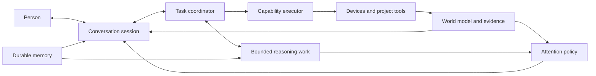

# Talos architecture review

Date: 2026-09-21. Status: consultant recommendations, not an approved implementation plan.

Follow-on: [Tool system review](TOOL_SYSTEM_REVIEW.md) examines capability
contracts, execution, retrieval/RAG, and proposed InfoPanel tools in more detail.

Actionable follow-up documents now live in
[architecture_fixes_09212026](architecture_fixes_09212026/README.md).
The owner subsequently authorized two bounded repairs: remove the no-op lights
tool and preserve local streaming tool history/schema snapshots. Those repairs
are implemented there; the broader assessment below is the original consultation.

## Product direction

Talos is a voice-first, home-bound assistant that maintains continuity across household activity, conversation, and engineering work. The owner's reference is Jarvis: timely perception, competent action, conversational continuity, and judgment about when to speak. Household automation and engineering tools are capabilities of that assistant, not competing definitions of the product. Future capabilities should fit without changing this identity.

Presentness should mean observable behavior: Talos follows an interrupted conversation, remembers a pending task, notices a relevant change, gives a useful update at an appropriate moment, and accurately distinguishes what it knows, attempted, completed, and actually said. Personality alone cannot provide this.

## Assessment

The strongest recommendation is to reorganize ownership of conversation, evidence, work, and attention before replacing models. Keep the existing durable state and safety foundation. Evolve a modular application with the existing justified process boundaries; a new service fleet would add more coordination problems.

This review inspected runtime paths, configuration, representative tests, deployment composition, CI, current status, invariants, decisions, and the Phase 9 brief. It did not run the deployed system, inspect private transcripts or databases, or reproduce model behavior. Historical measurements below are repository reports, not new results.

| Concern | Evidence in this checkout | Architectural implication |
|---|---|---|
| Tool failures contaminate later turns | `talos/agent/runtime.py` stores only command/response text across streaming turns; tool exchanges survive only inside one request. `_history_grounding_notice` compensates with another instruction. | Persist bounded structured tool exchanges and outcome evidence alongside dialogue. A transcript is not the action ledger. |
| Patch accumulation in orchestration | The roughly 3,000-line runtime owns prompts, memory, provider lanes, tool scoping, argument recovery, domain preflights, pump routing, output shaping, cancellation, and telemetry. | Extract responsibilities behind tested interfaces; moving files alone will not fix ownership. |
| Hardcoded behavior substitutes for judgment | `router.py` has a fixed background acknowledgement; the streaming runtime has a direct pump route and deterministic response; `request_classifier.py` routes by phrases. | Keep deterministic execution and emergency fallback. Let ordinary wording and interpretation evolve independently. |
| Awareness is an umbrella | `awareness/api/app.py` composes ingestion, state, alerts, actions, reminders, memory, briefing selection, and delivery workers. | Separate conceptual responsibilities while retaining working transactions, outboxes, and deployment boundaries. |
| Context is only as good as its inputs | The broker uses entity IDs for relevance; inspected router interaction calls do not supply them. Presence signals report positive interactions, not continuous physical observation. | Model active focus explicitly and report unknown presence honestly. More prompting cannot manufacture missing perception. |
| Memory has multiple owners | `talos/memory/store.py` stores conversation and facts in SQLite; awareness has PostgreSQL memory services; jobs have another SQLite store. | Define authority by record type before considering storage consolidation. Separate stores are not inherently wrong; competing meanings are. |
| Implementation claims exceed acceptance evidence | Status documents record substantial focused testing but repeatedly defer live voice/latency/briefing acceptance. | Evaluate the complete experience, including what reaches the speaker and what changes in the house. |
| CI is not a behavioral safety net | `.github/workflows/ci.yml` only runs `compileall InfoPanel Peripherals tests`, excluding `talos/`. | Add a deliberate runnable contract-test lane before extracting runtime responsibilities. |

## Tool use: fix the evidence loop first

The user's observation is consistent with the current history design. ADR-049 reports a previous captured-request experiment in which tool use degraded as prose-only history grew and recovered when a real tool exchange was restored. That is strong evidence for a design flaw, but not proof that model capability, templates, or prompts are otherwise adequate.

The model identity also needs verification. The owner describes a 12B instruct model, while historical repository diagnostics describe Qwen3 14.8B Q4_K_M. The configured name is only `mb-core-v1:latest`. Its checked-in Modelfile references a machine-specific Windows blob and contains `TEMPLATE {{ .Prompt }}`. That is a reproducibility and tool-serialization concern, not proof of the running model's template. Inspect the deployed model's actual metadata/template and request serialization before diagnosing capacity or buying larger hardware.

Recommended conversation contract:

- Preserve user utterances, assistant messages, typed tool calls, matching call IDs, bounded results, timestamps, errors, and interruption/playback state. Trim complete exchanges together; do not leave orphan tool results.
- Keep source references and freshness with evidence. Past successful tool use teaches the interaction pattern, but does not prove today's device state.
- Keep old prose as conversation history with unverified provenance. Do not backfill invented tool calls to make old answers look grounded.
- Give the model a compact, relevant capability surface and a way to discover more. Compare that with a stable broader surface: smaller schemas may improve selection but dynamic changes can lose prompt-cache benefits.
- Require typed execution outcomes before emitting completion claims. Preserve distinctions such as proposed, awaiting confirmation, accepted, dispatched, acknowledged, observed, failed, and unknown. Successful transport is not physical completion.
- Permit one bounded repair or escalation for malformed/missed calls, then report uncertainty. Do not grow an unlimited phrase-to-action patch library.

Test clean history, long successful history, deliberately contaminated history, failed tools, missing tools, ambiguous targets, and follow-up references. Measure tool selection, argument validity, correct action, unsupported claims, and recovery separately. First compare the same deployed model under corrected history/template/tool conditions; only then compare model alternatives.

## Proposed ownership boundaries

These are logical boundaries, not a requested new directory tree or set of services.

| Owner | Responsibility | Existing material to reuse |
|---|---|---|
| Conversation session | Turn-taking, interruption, current references, audible dialogue, one coherent voice | Voice worker, streaming speaker, interruption handling, conversation store |
| Task coordinator | Foreground/background work, cancellation, deadlines, progress, result delivery | Router, job manager/store, request IDs |
| Capability executor | Registered tool schemas, permissions, validation, execution, authoritative receipts | MCP adapters, action service and registry |
| World model | Observations, qualified current state, history, telemetry, source health | Awareness ingestion/state/history/database |
| Attention policy | Whether, when, and why to interrupt; relevance and user feedback | Attention items, briefing assembly/selection, delivery ledgers |
| Memory | Durable user/project facts with provenance, correction, retrieval, retention | Existing memory stores, with an explicit authority map |

All model-originated actions converge on the executor. Engineering work can gain project context, artifacts, and longer jobs without gaining a second unrestricted household control path. Models choose and explain; code validates and records; firmware retains immediate interlocks.

## Fast conversation and background reasoning

This is the more valuable near-term direction, and existing foreground/background jobs are a useful starting point. They are not yet a demonstrated independent fast-model/slow-model architecture: the router delegates into the existing runtime, and the checked-in thinking setting is `never`.

Keep one conversational identity with distinct execution budgets. The conversation lane handles dialogue, clarification, quick grounded queries, and short actions. It can submit longer work and continue listening. The background lane investigates, plans, gathers evidence, and proposes actions or produces artifacts. It returns structured progress and results to the conversation owner, rather than independently addressing the user.

Start with these as scheduling roles; two resident models are an experiment, not a prerequisite. Two models contending for one GPU can make the supposedly instant lane slower. Establish foreground priority, bounded background concurrency, cancellation, and resource measurements before assuming more models mean less latency.

Treat the proposed “train of thought” as resumable task state: objective, constraints, evidence, unresolved questions, next step, and result. Continuous private monologue is neither a reliable database nor a useful scheduling primitive. Wake background work on relevant events, deadlines, explicit tasks, or bounded review intervals. Stop when there is no useful work.

A result must identify its originating request and context version. If the user changes the target or cancels, stale work cannot quietly execute. Revalidate state and authorization at execution time. Cancelling speech, cancelling inference, and cancelling an already-dispatched physical action are different operations and need distinct outcomes.

For “water the plant while you review this circuit,” the short registered action and the engineering job can have different deadlines while sharing the same conversation. Talos should announce the watering result from evidence and later offer the circuit finding without losing either thread. This is a proposed acceptance scenario, not a claim of current support.

## Native voice

Native speech is worth prototyping, but it does not replace the task/evidence architecture. OpenAI's current documentation explicitly supports speech-to-speech sessions, chained pipelines, and a full-duplex voice frontend that delegates to a separate backend. These are valid alternatives rather than a universal progression away from STT/TTS. This review makes no claim about Anthropic's internal voice architecture. [Official OpenAI voice-agent guide](https://developers.openai.com/api/docs/guides/voice-agents), consulted 2026-09-21.

| Option | Potential benefit | Cost or uncertainty for Talos |
|---|---|---|
| Improve existing streaming STT → agent → TTS | Reuses local deployment, explicit text/evidence controls, existing telemetry | Endpointing, recognition, synthesis, and buffering still affect conversational rhythm |
| Native audio model with tools | Potentially more natural timing/prosody and fewer application-level stages | Must validate tool correctness, interruption, evidence records, exact names/numbers, local feasibility, and failure behavior |
| Native voice frontend plus reasoning backend | Closely matches continuous conversation during engineering work | Adds coordination and possibly cloud/network dependence; resource and latency advantage remains to be measured |

Recommendation: make the conversation/backend contract independent of the speech implementation, then compare the current pipeline with one isolated native-voice prototype using the same tasks and executor. Preserve a local working path. Hosted audio would require an explicit owner choice about audio leaving the home; the existing local-first invariant is not silently waived by this review.

Measure end-of-speech to first useful audio, time to verified action, tool accuracy, interruption-stop time, incorrect continuation after interruption, silence, and task completion. Record acknowledgements separately from useful answers. A fast “working on it” must not hide slow or failed execution. Include room noise, corrections, numbers, named devices, and foreground conversation during background load. Historical p50 1238 ms / p95 2541 ms is a reference only, not a current baseline.

## Awareness: retain the foundation, expose its limits

Awareness already has substantive deterministic machinery. Calling it ineffective solely because it is not an autonomous reasoning loop would miss its value. However, observing a condition, remembering it, selecting it for context, deciding to speak, and deciding to act are separate capabilities.

The committed settings enable situation context and briefings. `AwarenessSettings.briefing_model_enabled` defaults to false, and the inspected settings file does not override it. Optional model selection ranks supplied candidate IDs; it is not general reflection or open-ended initiative. Environment overrides and live rollout were not inspected.

Positive interaction signals are also not a complete occupancy model. Explicit presence semantics intentionally avoid inferring departure from silence. That protects against false departures, but arrival-triggered behavior needs a credible absence/arrival source. Do not reintroduce silence expiry merely to manufacture arrival events. Conversation focus likewise needs actual entity attribution before relevance weighting can help.

Retain world-state storage, exact retrieval, alerts, outboxes, reminders, and action safety. Give attention a narrow, measurable contract: candidate evidence, importance, relevance, expiry, interruptibility, cooldown, and delivery outcome. Background reasoning may propose an insight tied to evidence, but deterministic policy decides whether it may interrupt or execute. Critical notifications retain model-independent delivery and wording.

Add a visible trace through observation → state/attention candidate → selection or suppression reason → queued delivery → playback outcome where observable. The voice adapter currently proves enqueue only. Store that truth; even playback completion would not prove the person heard it. Evaluate usefulness and unwanted interruptions with owner feedback rather than counting injected context tokens.

## Hardcoded language

The appropriate distinction is between fixed facts and flexible expression. Preserve exact action semantics, confirmation requirements, numeric limits, emergency messages, and truthful unavailable/error fallbacks. Ordinary acknowledgements, explanations, and briefings can be model phrased from a constrained evidence bundle.

Do not insert a second model call after every trivial tool result just to vary wording. Use the conversational model's normal result turn where practical, and permit concise deterministic fallback when inference is unavailable or would delay an urgent notification. Remove device-specific canned dialogue only as the common execution/result contract replaces it and passes the relevant scenarios.

## Documentation and expansion

Documentation debt is primarily competing authority, not age. The implementation-status page mixes historical instructions with current state; the subsystem README still claimed Phase 8 meant all phases were complete; the Phase 9 plan describes intended behavior while later decisions modify it. Deleting those records indiscriminately would lose useful rationale.

Suggested durable documentation structure:

1. A concise product definition and current architecture entry point.
2. Current operating instructions and verified deployment assumptions.
3. An active status page containing only current state, acceptance gaps, and the next authorized task.
4. Decisions with explicit accepted/superseded/proposed status.
5. Historical plans and handoffs discoverable through an archive index, with no authority to initiate work.

Before moving or deleting documents, inventory inbound links and identify which decisions still govern. Before removing old test/demo scripts, check launcher/manual use; filenames alone are insufficient evidence of dead code. Keep experiments out of the runtime map unless promoted deliberately. Existing untracked TUI/wireframe work was left untouched.

For expansion, require every capability to declare its schemas, evidence/results, permissions, latency class, cancellation semantics, and domain context. Add domain adapters rather than new branches in the central runtime for every project tool or appliance. Avoid a plugin-framework rewrite until a real extension requires it.

## Recommended sequence and decision gates

1. **Establish truth and baseline.** Verify deployed model/template, tool availability, context, and live latency. Add a small representative multi-turn evaluation set and runnable CI contracts. Exit: reproducible failures and outcome/timing measurements, not only unit-test totals.
2. **Repair conversation/evidence continuity.** Persist structured exchanges, preserve freshness, distinguish action and playback receipts, test recovery after hallucination. Exit: no unsupported success claims in the acceptance corpus, correct rechecking of current state, and no orphan tool history.
3. **Extract coordination and execution boundaries.** Reuse jobs/actions; unify result semantics and foreground priority. Exit: conversation remains responsive under background work, corrections invalidate stale work, and actions retain safety guarantees.
4. **Make attention useful.** Supply reliable focus/presence inputs, inspect suppression decisions, validate proactive timing and recall. Exit: owner accepts useful notifications and quiet behavior across realistic daily scenarios.
5. **Compare speech backends.** A/B current streaming speech against a native-audio prototype behind the same execution contract. Exit: measured improvement in conversational quality without loss of tool reliability, local requirements, or interruption correctness.

These are proposed work packages, not newly authorized awareness phases. Each needs a bounded scope before implementation. Do not combine model replacement, history redesign, database migration, and speech replacement into one release.

## Session handoff

- Session goal/current phase: bounded architecture consultation; no implementation phase opened.
- Completed: source-based assessment, proposed boundaries and evaluation sequence, small documentation corrections.
- Added: this review, which also serves as the session handoff to avoid another standalone artifact.
- Modified: root README; awareness subsystem README; implementation status, decisions, and open questions.
- Migrations/runtime changes: none.
- Confirmed decisions: owner's voice-first product direction and consultation-only scope. Technical proposals remain unaccepted.
- Assumptions changed: reported 12B identity is unverified; repository metadata is inconsistent. Briefing availability does not imply model selection or live acceptance.
- Validation passed: `git diff --check`; 21 local Markdown link targets across all six added/edited documents resolve; the new review has no trailing whitespace. No runtime tests, model evaluations, audio/hardware tests, or benchmarks run. No failed validation checks.
- Security/deployment implications: no deployment or data changes; local-first and physical safety invariants preserved.
- Unresolved: cloud-audio allowance; deployed model/template and resource budget; desired initiative permissions; authoritative memory ownership; measurable latency and interruption targets.
- Repository state: pre-existing untracked TUI/wireframe artifacts preserved.
- Next permitted task: owner review and selection of a bounded work package. Read this review, current status, and architectural invariants; follow the selected scope's references.
- Explicit stop: consultation complete. No structural migration, model replacement, deployment, or next phase begins automatically.
