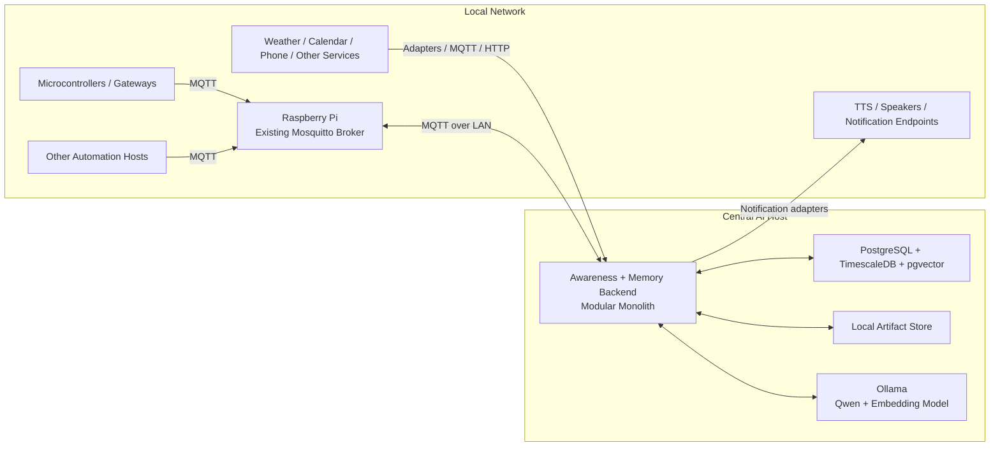
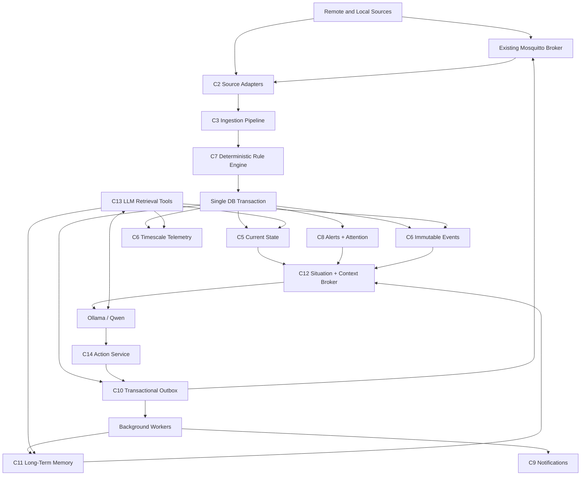

# Implementation Prompt: Robust Distributed Presence, Awareness, and Memory Subsystem

> **Audience:** A strong coding agent working inside the existing home automation repository.
>
> **Primary objective:** Implement the complete subsystem described below. Do not merely produce an architecture proposal.
>
> **Execution rule:** Complete the work in phases. Phase 0 is repository and deployment discovery. Finish Phase 0, write `DISCOVERY.md`, and stop for owner review before scaffolding or modifying the runtime architecture unless the owner explicitly instructs you to proceed without review.

---

## 1. Mission

Build a robust, local-first **presence, environmental awareness, event-processing, state, history, alerting, and memory subsystem** for a distributed home automation AI.

The broader system is intended to resemble a practical, ambient “Jarvis” rather than a desktop chatbot. It must feel continuously present in the home, understand what is happening now, remember relevant past events, know where information came from, and proactively notify the user when important events occur.

The assistant currently uses a local **Qwen 12B Q4 model through Ollama**. The memory/awareness subsystem will normally run on the same machine as Ollama and the LLM integration, but the complete home automation system is distributed: microcontrollers, gateways, notification devices, and other services may run on other machines.

A **Mosquitto MQTT broker already exists on a Raspberry Pi on the local network**. Reuse that broker. Do not deploy a second broker unless repository discovery proves that a separate broker is required and the owner approves it.

This subsystem is the deterministic data backbone around the LLM. It is not an LLM prompt trick, a transcript store, or a vector database attached to a chatbot.

---

## 2. Confirmed Environment Facts

Treat these as confirmed unless repository discovery produces direct contradictory evidence:

1. The main conversational model is Qwen 12B Q4 through Ollama.
2. Ollama and the central memory/awareness subsystem are expected to run on the same host.
3. Mosquitto is already running on a Raspberry Pi elsewhere on the LAN.
4. MQTT is a network transport, not the authoritative state store or permanent history store.
5. Microcontroller boards and other home automation components may run on separate machines.
6. Network connections may be interrupted, delayed, duplicated, reordered, or unavailable.
7. The complete solution must remain local-first. No cloud database, cloud vector service, or cloud embedding service may be introduced.
8. Critical safety handling must remain functional when Ollama is unavailable.
9. Immediate electrical and mechanical safety interlocks belong in firmware or hardware. The backend and LLM are not substitutes for local safety shutdown behavior.

---

## 3. Non-Negotiable Architectural Principles

Everything implemented must follow these principles.

### P1 — “Now” and “the past” are different data models

Current state is not the newest row in a generic event table and is not obtained through vector search.

- **NOW:** A compact, queryable, freshness-aware current-world model. It is updated in place while preserving source-event linkage.
- **PAST:** An immutable, append-only event history plus time-series measurements and summarized episodes.
- **MEMORY:** Validated semantic and episodic records derived from explicit evidence, each with provenance and temporal validity.

The LLM must receive explicit temporal status. It must not infer freshness from raw timestamps alone.

### P2 — The LLM is never the event loop, database, safety controller, or alert detector

The system must remain continuously aware without continuously running Qwen.

Deterministic code must perform:

- ingestion;
- schema validation;
- source authentication or allowlisting;
- deduplication;
- sequence checking;
- time/freshness evaluation;
- state updates;
- anomaly and safety rules;
- alert creation;
- notification fallback wording;
- retention;
- retry handling;
- action validation.

The LLM is used for conversation, reasoning, explanation, summarization, optional classification of ambiguous noncritical material, and structured memory proposals.

### P3 — Context is earned, not dumped

No raw sensor stream, entire database, full device registry, or undifferentiated transcript may be pushed into the LLM context.

A deterministic Context Broker must decide what reaches the model and enforce actual token limits.

### P4 — Exact questions use structured retrieval

Use current-state queries for current facts, SQL/time-series queries for exact historical or numeric questions, and vector retrieval only for material that benefits from semantic similarity.

### P5 — Distributed delivery is assumed to be imperfect

Every important message must be designed for duplicate delivery, delayed delivery, reordering, reconnects, and partial failure.

Important writes and downstream work must be idempotent and recoverable.

### P6 — The central database is authoritative

MQTT retained messages may provide convenient last-known values, but they are not the authoritative current-state store.

The authoritative event, state, alert, memory, action, and delivery records live in the central local database on the memory/LLM host.

### P7 — Preserve provenance and uncertainty

The system must be able to answer:

- Which source supplied this information?
- Through what transport and topic did it arrive?
- When did the source observe it?
- When did the backend receive it?
- Was it delayed?
- Is the source healthy?
- Is its clock trustworthy?
- Is the value current, stale, conflicting, inferred, historical, scheduled, or unknown?
- Which original events support a derived memory or conclusion?

### P8 — Fail safely and report limitations truthfully

If a component is down, the assistant must not imply that it is working.

Examples:

- “The last recorded temperature was 70°F, but the sensor has been offline for 18 minutes.”
- “I stored the event, but semantic search is temporarily unavailable because the embedding model is offline.”
- “The pump command was sent, but no acknowledgement was received.”

### P9 — Integrate additively

Do not rewrite functioning unrelated systems merely to impose this architecture.

Use adapters, interfaces, and repository conventions. Preserve backwards compatibility where practical.

### P10 — Prefer a modular monolith for the backend

Unless the repository is already a clean service-oriented system, implement one modular backend process with focused modules and background workers, backed by external local infrastructure.

Do not create a microservice fleet for its own sake.

---

## 4. Phase 0 — Repository and Deployment Discovery

Complete this phase first. Write the findings to `DISCOVERY.md`. Do not scaffold the subsystem until the report is complete and reviewed, unless the owner explicitly directs otherwise.

### 4.1 Repository inspection

Inspect the entire repository and identify:

1. Primary language, runtime, dependency manager, formatter, linter, and type checker.
2. Main application entry points.
3. Current Ollama and Qwen integration.
4. Existing tool/function-calling implementation.
5. Existing STT, TTS, notification, phone, calendar, weather, and voice pipelines.
6. Existing database, ORM, migrations, persistence, file-storage, and caching code.
7. Existing MQTT clients, topic conventions, credentials, reconnect behavior, and message schemas.
8. Existing HTTP, WebSocket, serial, gRPC, or other network transports.
9. Existing Home Assistant integration.
10. Existing device, entity, sensor, action, event, conversation, or agent-state models.
11. Existing Docker, Compose, systemd, supervisor, Kubernetes, or deployment files.
12. Existing test frameworks, fixtures, simulators, CI configuration, and logging.
13. Existing authentication, authorization, secrets management, and network binding.
14. Existing backup and recovery strategy.
15. Any repository facts that conflict with this specification.

### 4.2 Deployment inspection

Document the actual distributed topology as far as it can be determined:

- Host running Ollama.
- Host intended to run this subsystem.
- Raspberry Pi MQTT broker address and configured port.
- Whether MQTT TLS is enabled.
- MQTT authentication method and ACLs.
- Known microcontroller and gateway clients.
- Notification/TTS endpoints.
- Clock synchronization method on Linux hosts.
- Whether embedded devices have reliable clocks.
- Expected network segments, firewall rules, and hostnames.
- Any components that must operate while the central host is unavailable.

### 4.3 Home Assistant decision gate

If Home Assistant is present, document how its event bus, state machine, recorder, entity registry, and automation system overlap with this architecture.

Do not duplicate those layers blindly. Propose one of:

- build on Home Assistant as the authoritative state/event layer;
- consume Home Assistant as a source while retaining this backend as authoritative;
- use a hybrid arrangement with clearly defined ownership.

Wait for owner approval before choosing.

### 4.4 Required `DISCOVERY.md` output

Include:

- repository map;
- current runtime architecture;
- current deployment topology;
- current MQTT integration;
- current LLM/tool integration;
- current notification path;
- current persistence;
- constraints and risks;
- recommended mapping from the components in this prompt to repository locations;
- assumptions, each labeled:
  - `confirmed_by_repo`;
  - `confirmed_by_owner`;
  - `assumed_needs_confirmation`;
- proposed implementation sequence;
- proposed database deployment method;
- explicit decision on whether to use the default technology stack below.

---

## 5. Default Technology Stack

Use the repository’s existing equivalent where it is already established and suitable. Otherwise, use this default robust stack.

### 5.1 Central host

On the same machine as Ollama:

- **Python 3.11+** for the backend if the repository is Python.
- **PostgreSQL** as the primary relational source of truth.
- **TimescaleDB** extension for high-volume timestamped sensor measurements and aggregates.
- **pgvector** for initial semantic retrieval.
- **FastAPI** for internal HTTP APIs if no HTTP framework is already established.
- **SQLAlchemy 2.x** or the existing ORM.
- **Alembic** or the existing migration framework.
- **Pydantic v2** or equivalent strict schema validation.
- **asyncio-compatible** MQTT, database, and HTTP clients.
- **Ollama local embeddings**, with the model configured rather than hard-coded.
- **Local filesystem object storage** for large artifacts such as audio, images, logs, firmware, and diagnostic dumps.
- **Docker Compose** for PostgreSQL/Timescale/pgvector and the backend if this matches the deployment model.
- Existing process management if Docker conflicts with the repository.

### 5.2 MQTT

Use the existing Mosquitto broker on the Raspberry Pi.

The backend must connect as a client over the LAN. Configuration must support:

- host;
- port;
- TLS on/off;
- CA path;
- client certificate and key where used;
- username/password where used;
- client ID;
- keepalive;
- clean-start/session behavior;
- reconnect backoff;
- topic prefix;
- QoS per topic class.

Do not hard-code the Raspberry Pi IP or credentials.

### 5.3 Optional Redis

Redis may be added only if there is a demonstrated need for caching, distributed locks, or transient coordination.

Redis must not be the only authoritative current-state store.

### 5.4 Technology substitution

If PostgreSQL/TimescaleDB/pgvector cannot reasonably run on the host, document the reason and propose a local substitute. Any substitute must preserve:

- transactions;
- immutable event history;
- durable current state;
- an outbox;
- indexed temporal queries;
- semantic retrieval;
- migrations;
- backups;
- concurrency safety.

Do not silently downgrade to an in-memory dictionary or unversioned flat files.

---

## 6. Target Deployment Topology

Use this as the default topology and adapt it to repository findings.



### 6.1 Ownership

- Mosquitto transports messages.
- The central backend validates and processes them.
- PostgreSQL is the authoritative source of truth.
- TimescaleDB stores high-volume numeric telemetry.
- pgvector indexes selected semantic material.
- Ollama performs local inference and embeddings.
- Remote devices retain local safety responsibilities.

### 6.2 Network-partition behavior

Design explicitly for:

- MQTT broker temporarily unreachable from central host;
- central host temporarily unreachable from broker;
- source publishing while backend is offline;
- MQTT redelivery after reconnect;
- duplicate messages;
- device restarts and sequence resets;
- time drift;
- notification endpoint failure;
- database restart;
- Ollama restart.

Document the delivery guarantees that can and cannot be achieved.

---

## 7. Requirements Traceability

Keep this table in the subsystem README and update it as implementation decisions change.

| ID | Requirement | Primary components |
|---|---|---|
| R1 | Ingest streams from sensors, microcontrollers, services, conversations, and internal components | C2, C3 |
| R2 | Store, aggregate, summarize, or discard data according to policy | C4, C5, C6, C15 |
| R3 | Distinguish current state from historical events | C5, C6 |
| R4 | Maintain strong environmental awareness | C5, C12 |
| R5 | Track when, where, how, and from what source information entered | C1, C4 |
| R6 | Track the health and state of connected systems | C4, C5, C16 |
| R7 | Detect important events independently of the LLM | C7 |
| R8 | Proactively alert the user | C8, C9 |
| R9 | Remain fully local | C17 |
| R10 | Avoid unnecessary LLM context use | C12 |
| R11 | Selectively push only relevant data to the LLM | C7, C12 |
| R12 | Allow the LLM to retrieve additional information | C13 |
| R13 | Remain functional when Ollama is unavailable | C7, C8, C16 |
| R14 | Handle duplicate, delayed, missing, and out-of-order messages | C1, C3, C5 |
| R15 | Persist critical downstream work reliably | C10 |
| R16 | Support stale, conflicting, unknown, and offline state | C5 |
| R17 | Support validated semantic and episodic memory | C11 |
| R18 | Preserve provenance and temporal validity of memory | C11 |
| R19 | Support distributed deployment over the LAN | C2, C16, C17 |
| R20 | Integrate with current code without unnecessary rewrites | Phase 0, C18 |
| R21 | Validate physical actions and record acknowledgements | C14 |
| R22 | Apply configurable retention and safe deletion | C15 |

---

## 8. Logical Architecture



---

## 9. Components

Implement these as logical modules. Adapt names and directories to repository conventions.

---

## C1 — Canonical Event Envelope

### Responsibility

Represent every piece of information entering the central backend in a strict, versioned, provenance-aware structure.

### Required schema

Use an equivalent of:

```python
class EventEnvelope(BaseModel):
    event_id: UUID
    schema_version: int
    event_type: str
    entity_id: str | None
    source_id: str
    location_id: str | None

    observed_at: datetime | None
    received_at: datetime
    processed_at: datetime | None

    sequence: int | None
    source_boot_id: str | None

    correlation_id: str | None
    causation_id: str | None

    severity: Literal["debug", "info", "notice", "warning", "critical"]
    confidence: float

    retention_class: str | None
    expires_at: datetime | None

    payload: dict[str, Any]
    provenance: Provenance
```

```python
class Provenance(BaseModel):
    transport: str
    topic_or_endpoint: str | None
    gateway_id: str | None
    firmware_version: str | None
    software_version: str | None
    clock_quality: Literal[
        "unknown",
        "unsynchronized",
        "device_local",
        "device_synced",
        "gateway_stamped",
        "server_received",
    ]
    clock_offset_ms: float | None
    authenticated_identity: str | None
    metadata: dict[str, Any]
```

### Timestamp rules

Never conflate:

- `observed_at`: when the originating source says it happened;
- `received_at`: when the central backend received it;
- `processed_at`: when processing completed;
- `valid_from` / `valid_to`: validity of state or memory;
- `expires_at`: when data becomes stale or irrelevant;
- `created_at`: database row creation time.

Use timezone-aware UTC in storage. Preserve original timezone information in metadata where relevant.

When device clocks are untrustworthy, use `received_at` for ordering and preserve `observed_at` only as untrusted evidence.

### Identity and ordering

For important device events:

- require unique `event_id`;
- support monotonically increasing `sequence`;
- support `source_boot_id` so a legitimate sequence reset after reboot is distinguishable;
- detect duplicate IDs;
- detect duplicate `(source_id, source_boot_id, sequence)`;
- detect missing sequence ranges;
- detect out-of-order delivery;
- do not discard delayed events merely because they cannot update current state.

### Validation

- Strictly validate schema version.
- Reject oversized payloads.
- Validate source ownership of MQTT topics.
- Park malformed or unauthorized messages in a dead-letter store.
- Do not crash the ingestion process.
- Emit metrics and structured logs for rejection.

---

## C2 — Source Adapters and MQTT Integration

### Responsibility

Connect existing data sources to the canonical event pipeline while isolating source-specific parsing.

### MQTT rules

Reuse the existing Raspberry Pi Mosquitto broker.

Use topic conventions compatible with the existing system. Prefer:

```text
home/{domain}/{entity_id}/state
home/{domain}/{entity_id}/event
home/{domain}/{entity_id}/telemetry/{measurement}
home/{domain}/{entity_id}/health
home/{domain}/{entity_id}/heartbeat
home/{domain}/{entity_id}/command
home/{domain}/{entity_id}/command_ack
```

Do not change established topics without an explicit migration plan.

### QoS guidance

Default guidance:

- routine high-frequency telemetry: QoS 0 or 1 depending on loss tolerance;
- meaningful state changes: QoS 1;
- safety events: QoS 1 with application-level idempotency;
- commands and acknowledgements: QoS 1 with unique command IDs;
- do not treat QoS as a replacement for database transactions or idempotency.

### Retained messages

Retained state messages may be consumed to bootstrap last-known values after reconnect, but:

- mark them as retained/replayed in provenance;
- evaluate their age;
- do not assume they are current;
- do not make them authoritative without freshness validation.

### Connection behavior

Implement:

- persistent reconnect loop with bounded exponential backoff and jitter;
- connection health state;
- subscription restoration;
- clean session behavior appropriate to the broker;
- configurable keepalive;
- graceful shutdown;
- metrics for reconnects and message lag;
- logging without credentials.

### Non-MQTT adapters

Provide thin adapters for sources such as:

- weather;
- calendar;
- phone;
- STT/voice;
- system health;
- local services;
- Home Assistant if present.

Adapters may use MQTT, HTTP, library calls, or internal queues, but all downstream data must become canonical events.

### Remote-source buffering

Where remote source software is under this repository’s control, support a bounded local store-and-forward queue for important events when the broker is unavailable.

Requirements:

- bounded disk usage;
- event IDs generated before queueing;
- ordered retry where useful;
- duplicate-safe delivery;
- explicit dropping policy for low-value telemetry;
- no unbounded memory queues.

Do not claim reliable offline buffering for firmware or hosts that do not implement it.

---

## C3 — Ingestion Pipeline

### Responsibility

Process every received event through a deterministic, observable, idempotent pipeline.

### Required stages

```text
transport receive
→ parse
→ payload-size check
→ source authentication / authorization
→ schema validation
→ normalization
→ deduplication
→ sequence evaluation
→ timestamp and clock-quality evaluation
→ classification
→ deterministic rule evaluation
→ transactional persistence
→ current-state update
→ alert / attention update
→ outbox work creation
→ acknowledgement when applicable
```

### Classification output

A single event may produce several actions:

```text
DROP
STORE_DEAD_LETTER
STORE_RAW
STORE_HISTORY
STORE_TELEMETRY
UPDATE_CURRENT_STATE
UPDATE_SOURCE_HEALTH
CREATE_ALERT
UPDATE_ALERT
CREATE_ATTENTION_ITEM
CREATE_MEMORY_CANDIDATE
INJECT_ON_NEXT_INTERACTION
TRIGGER_DETERMINISTIC_ACTION
QUEUE_NOTIFICATION
AGGREGATE_ONLY
```

### Idempotency

Processing the same event more than once must not:

- create duplicate immutable events;
- create duplicate alerts;
- send duplicate notifications outside policy;
- repeat a physical action;
- create duplicate memory candidates.

Use database uniqueness constraints in addition to application checks.

### Transaction boundary

For one accepted event, write the following in one database transaction when applicable:

- normalized immutable event;
- measurement row;
- current-state changes;
- source-health changes;
- alert changes;
- attention items;
- memory candidate references;
- action request;
- outbox records.

Do not perform network notifications, embeddings, or LLM calls inside the transaction.

---

## C4 — Entity, Location, Device, and Source Registry

### Responsibility

Maintain the system’s structured model of what exists and where information comes from.

### Required entities

Support:

- rooms and locations;
- people;
- plants;
- devices;
- controllers;
- sensors;
- actuators;
- services;
- automations;
- software agents;
- notification endpoints.

### Relationships

Support typed relationships with optional validity periods:

- sensor `belongs_to` device;
- device `located_in` room;
- plant `monitored_by` sensor;
- pump `waters` plant;
- controller `controls` pump;
- person `detected_in` room;
- service `depends_on` host;
- source `reports_for` entity.

### Source registry fields

At minimum:

```text
source_id
source_type
display_name
transport
entity_id
location_id
firmware_version
software_version
schema_version
expected_update_interval
stale_after_seconds
offline_after_seconds
clock_quality
last_observed_at
last_received_at
last_sequence
last_boot_id
health_status
enabled
authentication_identity
metadata
created_at
updated_at
```

### Source health

Health statuses should include:

```text
healthy
degraded
stale
offline
misconfigured
unauthorized
unknown
```

A source going silent is not automatically a critical alert. Severity depends on source criticality and configured policy.

---

## C5 — Current State Store and Situation State

### Responsibility

Maintain the latest valid known state of the world, with freshness, authority, conflict, and provenance.

### Authority

Store current state durably in PostgreSQL. A cache may accelerate reads, but the database is authoritative.

### State model

At minimum:

```text
entity_id
property_name
value_json
value_type
observed_at
received_at
updated_at
valid_from
expires_at
confidence
source_id
source_event_id
state_status
authority_rank
metadata
```

Enforce one active current-state row per `(entity_id, property_name)`.

### Required state statuses

```text
current
stale
unknown
conflicting
offline
inferred
scheduled
```

### Update rules

The State Manager must:

- determine whether an event is newer than current state;
- determine whether its source is more authoritative;
- handle delayed and out-of-order events;
- preserve delayed events in history even when they do not replace state;
- apply configured source priority;
- apply confidence;
- detect conflicts;
- update freshness deadlines;
- preserve source-event linkage;
- emit meaningful state-transition events;
- avoid transition noise within deadbands;
- support hysteresis.

### Freshness worker

A deterministic worker must:

- mark values stale after `expires_at` or source-specific freshness deadlines;
- mark sources offline after configured thresholds;
- update derived entity state where appropriate;
- open, update, or resolve alerts according to policy;
- avoid repeatedly creating the same alert.

### Situation state

Maintain or generate a compact structured situation object from:

- relevant current state;
- active alerts;
- attention items;
- recent meaningful transitions;
- likely user location;
- conversation state;
- ongoing tasks;
- system health.

Do not store a massive, constantly regenerated natural-language world narrative.

---

## C6 — Immutable Event History and Time-Series Telemetry

### Responsibility

Preserve exact normalized history and efficiently store numeric telemetry.

### Event store

Events are append-only and immutable.

Support:

- exact lookup by event ID;
- time-range queries;
- source/entity/type/severity filters;
- correlation and causation traversal;
- replay;
- root-cause tracing;
- derived-record provenance;
- pagination;
- bounded results.

Use JSONB for flexible payloads, with typed columns for commonly queried attributes.

### Time-series measurements

Use TimescaleDB hypertables where appropriate.

Measurement fields should include:

```text
time
received_at
entity_id
source_id
measurement_name
value_double or typed value
unit
quality
confidence
source_event_id
metadata
```

### Aggregation

Implement configurable:

- raw retention;
- one-minute aggregates;
- hourly aggregates;
- daily aggregates;
- minimum;
- maximum;
- average;
- count;
- standard deviation;
- threshold/anomaly counts where useful.

Do not embed raw telemetry.

### Query interface

Provide bounded structured queries such as:

```python
query_sensor_history(
    sensor_id: str,
    measurement: str,
    start_time: datetime,
    end_time: datetime,
    aggregation: str | None,
    interval: str | None,
    max_points: int,
) -> SensorHistoryResult
```

Reject unbounded time ranges and unlimited point counts.

---

## C7 — Deterministic Classification, Salience, and Rule Engine

### Responsibility

Decide what each event means operationally without involving the LLM in the hot path.

### Policy model

Separate:

1. **Hard rules:** safety and operational conditions that always override scoring.
2. **Classification actions:** where the data is stored and what downstream work is created.
3. **Salience score:** noncritical priority for context and attention.
4. **Retention class:** how long the data is retained.
5. **Interruptibility:** how and when the user should be notified.

### Salience inputs

A noncritical score may combine:

- severity;
- novelty;
- user relevance;
- persistence;
- confidence;
- recency;
- environmental impact;
- actionability;
- redundancy penalty;
- active conversation;
- notification cooldown.

### Rules

Rules should live in version-controlled YAML/TOML or typed classes with a strict schema.

Support:

- thresholds;
- booleans;
- state transitions;
- rate of change;
- time windows;
- missing data;
- source health;
- multiple correlated events;
- cooldowns;
- deduplication keys;
- escalation;
- acknowledgement;
- automatic resolution;
- manual resolution;
- suppression.

### Example rule

```yaml
id: plant_overflow
version: 1
match:
  event_type: plant.overflow.detected
conditions:
  - field: payload.overflow
    op: equals
    value: true
actions:
  - STORE_HISTORY
  - UPDATE_CURRENT_STATE
  - CREATE_ALERT
  - CREATE_ATTENTION_ITEM
  - CREATE_MEMORY_CANDIDATE
severity: critical
retention_class: critical_safety
alert:
  deduplication_key: "plant_overflow:{entity_id}"
  title: "Plant overflow detected"
  fallback_message: "The {entity_display_name} watering system detected an overflow and should be checked."
attention:
  interruptibility: immediate
```

### Optional LLM classification

An optional small-model or LLM classifier may process ambiguous, noncritical events asynchronously.

It must never:

- block ingestion;
- override hard safety rules;
- directly send an alert;
- create permanent memory without validation.

---

## C8 — Alerts and Attention Manager

### Responsibility

Represent abnormal conditions separately from the decision of when to interrupt the user.

### Alerts

Alerts are persistent conditions with lifecycle.

Required fields:

```text
alert_id
alert_type
severity
entity_id
location_id
title
description
opened_at
last_updated_at
resolved_at
acknowledged_at
status
deduplication_key
source_event_ids
recommended_actions
notification_policy
metadata
```

Statuses:

```text
open
acknowledged
suppressed
resolved
expired
```

### Attention items

Attention items model delivery timing and conversational relevance.

Required fields:

```text
attention_item_id
priority
reason
entity_id
alert_id
created_at
available_after
expires_at
interruptibility
preferred_channel
cooldown_key
delivery_status
conversation_relevance
metadata
```

Interruptibility:

```text
immediate
interrupt_when_safe
next_interaction
passive
```

### Behavior examples

- Overflow: immediate.
- Safety-critical sensor offline: immediate.
- Noncritical sensor offline: next interaction.
- Low battery: next interaction or passive.
- Routine watering completed: passive or store only.
- Severe weather warning: based on severity, location, and timing.
- Calendar reminder while user is on a call: wait unless urgent.

### Deduplication

One persistent incident should update one alert, not create a new alert every time the same signal repeats.

Track first seen, last seen, occurrence count, and latest supporting event.

---

## C9 — Notifications and Proactive Behavior

### Responsibility

Deliver important information without waiting for a user query.

### Notification interface

Use adapters behind one interface:

```python
class NotificationAdapter(Protocol):
    async def send(self, request: NotificationRequest) -> DeliveryResult: ...
```

Possible channels:

- local TTS;
- home speaker;
- desktop;
- dashboard;
- phone;
- email;
- future mobile push.

Initially implement only the channels already present, but keep the interface extensible.

### Critical alerts

Critical notifications must not depend on the LLM to produce wording.

Flow:

1. Rule engine opens or updates alert.
2. Database transaction creates notification outbox item.
3. Worker renders deterministic fallback wording.
4. Worker sends notification.
5. Delivery attempt and result are persisted.
6. Retry according to policy.
7. Optionally allow the LLM to improve wording after the core alert exists, but never delay the fallback alert.

### Notification delivery model

Track:

```text
notification_request_id
alert_id
attention_item_id
channel
recipient_or_endpoint
attempted_at
status
error
retry_count
acknowledged_at
provider_message_id
metadata
```

Do not mark a notification delivered unless the adapter confirms delivery according to that channel’s semantics.

### Cooldowns and escalation

Support:

- cooldowns;
- rate limits;
- channel fallback;
- escalation for repeated critical delivery failure;
- quiet-hour policy for noncritical notifications;
- interruption suppression during calls or conversations;
- user acknowledgement where available.

---

## C10 — Transactional Outbox and Background Work

### Responsibility

Prevent critical work from being lost between database commit and network/LLM operations.

### Outbox

A database transaction may create outbox records for:

- notification;
- embedding generation;
- memory extraction;
- episodic summarization;
- retention;
- action dispatch;
- MQTT command;
- external adapter update;
- conversation summarization.

Required fields:

```text
outbox_id
work_type
aggregate_type
aggregate_id
payload
idempotency_key
created_at
available_at
attempt_count
next_attempt_at
last_error
locked_at
locked_by
completed_at
status
```

### Worker requirements

Workers must:

- claim rows safely;
- use bounded batches;
- use `SKIP LOCKED` or equivalent;
- be idempotent;
- use bounded exponential backoff;
- release stale locks;
- expose backlog and oldest-item age;
- dead-letter unrecoverable work;
- support manual retry;
- preserve error details without secrets.

### Exactly-once statement

Do not claim true end-to-end exactly-once delivery.

Implement at-least-once work execution with idempotent consumers and database-enforced uniqueness.

---

## C11 — Long-Term Memory and RAG

### Responsibility

Store useful long-term semantic and episodic information without confusing transcripts, telemetry, and current state with memory.

### Memory types

#### Working or situational memory

Lifetime: seconds to hours.

Examples:

- user likely in kitchen;
- call active;
- task awaiting response;
- conversation topic.

Store in state/session tables, not the semantic vector index.

#### Episodic memory

Timestamped summaries of meaningful incidents or experiences.

Examples:

- overflow occurred after a forty-second watering cycle;
- network became unstable during router restart;
- device failed after firmware update;
- user spent an evening diagnosing a controller.

Each episode must link to supporting source events.

#### Semantic memory

Facts, names, preferences, stable patterns, and user-approved knowledge.

Examples:

- user prefers bedroom near 68°F at night;
- plant is named Herbert;
- a sensor is known to be unreliable;
- noncritical alerts should wait while user is on a call.

Semantic memory must support validity, contradiction, and supersession.

#### Procedural memory

Capabilities, topology, command schemas, safety rules, and procedures.

Prefer version-controlled configuration and documentation. Do not rely on free-form model recollection.

#### Archival telemetry

Numeric historical measurements. Keep in structured time-series storage. Do not treat it as semantic memory.

### Memory schema

At minimum:

```text
memory_id
memory_type
statement
structured_content
importance
confidence
scope
sensitivity
valid_from
valid_to
learned_at
expires_at
superseded_at
supersedes_memory_id
status
embedding_model
embedding_dimension
embedding_version
embedded_at
content_hash
created_at
updated_at
last_accessed_at
access_count
metadata
```

Statuses:

```text
candidate
accepted
rejected
active
superseded
expired
deleted
```

### Provenance

Use a separate provenance relation linking memories to:

- event IDs;
- message IDs;
- conversation IDs;
- source IDs;
- user confirmation;
- extraction job;
- model and prompt version.

### Memory write paths

#### Path 1 — Deterministic memory writes

Write structured facts directly when unambiguous and policy allows it:

- firmware version changed;
- user explicitly renamed a device;
- overflow incident occurred;
- device moved to a room;
- user explicitly requested that a preference be remembered.

#### Path 2 — LLM-proposed memory candidates

The LLM may propose a candidate in strict structured output.

The Memory Manager must then:

- validate schema;
- verify evidence references;
- reject unsupported claims;
- detect duplicates;
- search for contradictions;
- assign confidence;
- apply sensitivity policy;
- merge where appropriate;
- supersede older memory where appropriate;
- record the decision;
- queue embedding generation.

The LLM must not have unrestricted permanent-memory write access.

#### Path 3 — Consolidation

Periodic jobs may:

- group repetitive episodes;
- create daily or weekly summaries;
- reduce redundant memories;
- preserve source links;
- supersede outdated facts;
- decay weak inferred confidence;
- retain explicit user statements more strongly;
- re-embed changed summaries;
- apply retention policy.

### Contradiction and supersession

Never overwrite a semantic memory in place when the underlying fact changes.

When a new memory supersedes an old one:

- preserve the old record;
- set `valid_to`;
- mark it superseded;
- link the new record with `supersedes_memory_id`;
- give explicit user evidence greater weight than weak inference.

When evidence conflicts but is inconclusive, retain both with a conflict relationship rather than inventing certainty.

### Embeddings

Use local Ollama embeddings.

Only embed content that benefits from semantic retrieval:

- semantic memories;
- episodic summaries;
- conversation summaries selected by policy;
- device documentation;
- troubleshooting summaries;
- notes.

Do not embed:

- every message;
- every sensor sample;
- every heartbeat;
- raw audio;
- redundant event payloads;
- binary artifacts.

### Retrieval scoring

Where practical combine:

- vector similarity;
- full-text or keyword score;
- metadata filters;
- recency;
- importance;
- confidence;
- entity/location match;
- validity status.

Return component scores for debugging.

### Do not summarize every fixed time window blindly

Do not create an episode every fifteen minutes merely because time passed.

Create memory candidates when there is:

- a meaningful incident;
- a completed task or interaction;
- a notable state transition;
- an explicit user preference;
- a novel pattern;
- a selected conversation;
- a configured end-of-day summary.

---

## C12 — Situation Manager and Context Broker

### Responsibility

Decide what reaches Qwen and fit it under a hard context budget.

### Situation Manager

Produce a compact structured snapshot, for example:

```json
{
  "as_of": "2026-07-15T21:24:31Z",
  "user": {
    "likely_location": "kitchen",
    "presence_confidence": 0.84,
    "activity": "cooking",
    "activity_confidence": 0.61
  },
  "active_alerts": [
    {
      "type": "plant_overflow",
      "entity_id": "plant_zone_1",
      "severity": "critical",
      "status": "open",
      "age_seconds": 197
    }
  ],
  "relevant_state": {
    "kitchen_temperature_f": {
      "value": 72.1,
      "temporal_status": "current",
      "age_seconds": 11
    },
    "living_room_pump": {
      "value": "off",
      "temporal_status": "current",
      "age_seconds": 188
    }
  },
  "recent_changes": [
    "The living-room plant pump was shut down after an overflow."
  ],
  "system_health": {
    "offline_devices": [],
    "stale_sources": ["outdoor_temperature"]
  }
}
```

This is not a raw database dump and should be generated deterministically.

### Context selection order

Prioritize:

1. fixed system and safety instructions;
2. active critical alerts;
3. current user request;
4. current relevant state;
5. recent directly related events;
6. high-confidence semantic or episodic memories;
7. conversation history needed for coherence;
8. lower-confidence inferred context;
9. background context.

Do not fill unused context merely because tokens are available.

### Relevance

Do not include the entire current-state table on every turn.

Always include active critical alerts. Include other state based on:

- user request;
- current room;
- referenced entity;
- ongoing task;
- recent conversation;
- attention items;
- system-health relevance.

### Token budgets

Configure separate budgets for:

- system instructions;
- recent conversation;
- situation snapshot;
- retrieved memories;
- tool results;
- reserved response tokens.

Use the actual tokenizer when feasible. Otherwise use a conservative approximation.

Lower-priority context must be truncated first. Active critical alerts must survive truncation.

### Context-selection audit

Log for each included item:

- item identifier;
- source/provenance;
- reason selected;
- temporal status;
- estimated tokens;
- priority;
- whether truncated.

### Temporal rendering

Every model-visible fact should expose fields such as:

```text
temporal_status
observed_at
received_at
age_seconds
expires_at
state_status
confidence
source_id
```

Render human-readable relative time in conversational text, while preserving structured timestamps in tool output.

---

## C13 — LLM Retrieval Tools and Retrieval Router

### Responsibility

Allow Qwen to request additional information through narrow, validated, token-bounded tools.

### Tool principles

- Use strict JSON schemas.
- Validate all inputs.
- Enforce time-range and result-size limits.
- Return explicit temporal status and provenance.
- Never expose arbitrary SQL.
- Never expose unrestricted file access.
- Limit tool rounds per turn.
- Log tool calls and failures.
- Return clear model-visible errors.

### Minimum read tools

```text
get_current_state
get_room_state
get_entity
get_active_alerts
get_attention_items
get_recent_events
query_sensor_history
search_memory
get_device_health
get_event_provenance
get_system_health
get_system_capabilities
```

### Retrieval routing examples

| Question | Retrieval |
|---|---|
| Is the pump on? | current-state query |
| When did the pump last run? | event-history query |
| What was average pump current yesterday? | time-series aggregate |
| Why does this plant keep overflowing? | event history + episodic memory + relevant aggregates |
| Do I prefer the bedroom colder? | semantic memory |
| Is this sensor trustworthy? | source health + provenance + event history |
| What happened during the router restart? | correlated event history + episodic memory |

Do not use vector search as the default for exact, numeric, state, or temporal questions.

### Tool outputs

Tool output must be summarized or bounded before it re-enters context.

A tool call must never return thousands of raw measurements or an unbounded event stream.

---

## C14 — Action Request and Command Lifecycle

### Responsibility

Keep physical actuation outside unrestricted LLM control while preserving action provenance.

This subsystem may integrate with an existing action layer rather than replacing it.

### Rules

The LLM may request an action through a structured tool. It must not:

- publish arbitrary MQTT messages;
- execute arbitrary shell commands;
- bypass confirmation;
- invent unsupported actions.

### Action registry

Each action definition should include:

```text
action_name
target_type
parameter_schema
permission_level
requires_confirmation
safety_checks
cooldown
timeout
rollback_behavior
idempotency_behavior
allowed_states
```

### Lifecycle

```text
requested
validated
awaiting_confirmation
approved
dispatched
acknowledged
completed
failed
timed_out
cancelled
```

Store every transition.

### MQTT commands

Commands must have:

- command ID;
- idempotency key;
- target;
- parameters;
- requested-by actor;
- correlation ID;
- timeout;
- acknowledgement requirements.

Do not treat silence as success.

Where possible, confirm resulting device state after acknowledgement.

### Local safety

Critical devices must perform immediate safety shutdown locally. A plant controller detecting overflow should stop the pump in firmware before or while publishing the event.

---

## C15 — Retention, Consolidation, and Large Artifacts

### Responsibility

Control disk growth without losing important history or provenance.

### Suggested initial retention classes

Make all durations configurable.

- critical safety events: indefinite;
- important device state transitions: long term;
- raw high-frequency telemetry: 7–30 days;
- one-minute aggregates: 1–2 years;
- hourly and daily aggregates: long term or indefinite;
- routine heartbeats: brief;
- debug logs: 7–14 days;
- raw voice audio: delete quickly unless explicitly retained;
- conversation transcripts: configurable;
- semantic memories: until superseded, expired, or deleted;
- situation snapshots: not retained or retained briefly;
- unresolved alert evidence: protected from deletion.

### Retention worker

Implement:

- dry-run mode;
- logged deletion plan;
- bounded batch deletion;
- aggregate creation before raw deletion;
- protection for unresolved alerts;
- protection for memory provenance;
- tests against broad accidental deletion;
- resumability;
- idempotency.

### Large artifacts

Store large files outside PostgreSQL.

Examples:

- audio;
- images;
- firmware;
- diagnostic dumps;
- long recordings;
- generated reports.

Store metadata:

```text
artifact_id
artifact_type
path
mime_type
size_bytes
sha256
created_at
source_id
related_event_id
related_conversation_id
retention_class
expires_at
metadata
```

Use safe path handling. Never allow LLM tools to choose arbitrary filesystem paths.

---

## C16 — Failure Handling, Health, and Observability

### Responsibility

Degrade safely and expose truthful component status.

### System health

Track:

- database health;
- MQTT connection;
- broker address;
- Ollama health;
- chat model availability;
- embedding model availability;
- notification adapter health;
- disk usage;
- worker health;
- outbox backlog;
- failed jobs;
- stale sources;
- offline devices;
- current schema versions;
- current prompt/tool version;
- last successful backup.

### Ollama unavailable

The system must still:

- ingest events;
- update current state;
- evaluate deterministic rules;
- perform firmware/backend deterministic shutdown paths;
- create alerts;
- send fallback notifications;
- store conversations or requests where appropriate;
- queue embeddings and summaries for retry.

### PostgreSQL unavailable

The system must:

- report persistence as unavailable;
- avoid claiming writes succeeded;
- use a bounded local emergency spool only if explicitly implemented;
- avoid silently dropping critical events;
- fail safely for actions requiring durable state;
- expose health status.

If an emergency spool is implemented:

- use append-only local files or an embedded queue;
- bound disk usage;
- fsync important records;
- replay idempotently;
- document ordering and loss guarantees;
- do not use it as a second permanent database.

### MQTT unavailable

The backend must:

- expose connection status;
- retry with backoff;
- preserve outbound command state;
- avoid reporting commands complete without acknowledgement;
- update source freshness when expected events stop.

### Embedding unavailable

The system must:

- store accepted memory text;
- queue embedding work;
- permit exact/full-text search;
- continue alerts and current-state behavior.

### Notification failure

The system must:

- persist attempts;
- retry according to policy;
- escalate critical failures where another channel exists;
- avoid marking delivery as successful;
- keep the alert open.

### Structured logging

Include relevant identifiers:

```text
event_id
correlation_id
causation_id
source_id
entity_id
alert_id
action_id
conversation_id
outbox_id
notification_request_id
```

Never log secrets.

### Metrics

At minimum:

- events received;
- accepted;
- invalid;
- unauthorized;
- duplicate;
- delayed;
- out-of-order;
- sequence gaps;
- MQTT reconnects;
- message lag;
- stale sources;
- offline sources;
- open alerts by severity;
- notification failures;
- outbox backlog and age;
- tool-call latency;
- database latency;
- embedding backlog;
- context token use;
- memory candidates accepted/rejected;
- worker failures;
- disk usage.

Use the repository’s metrics stack if present. Otherwise expose a minimal internal metrics endpoint or structured counters.

---

## C17 — Security, Privacy, and Local-Only Guarantees

### Responsibility

Protect sensitive home, voice, device, and behavioral data.

### Network

- Bind internal APIs to loopback or the private LAN by default.
- Do not expose PostgreSQL publicly.
- Restrict database access by host firewall and credentials.
- Use MQTT authentication and ACLs.
- Validate MQTT topic ownership by source.
- Support TLS to the broker where practical.
- Do not assume a trusted LAN is equivalent to no security.

### APIs

- Authenticate state-changing endpoints.
- Authorize actions and alert acknowledgement.
- Rate-limit sensitive endpoints.
- Validate input sizes.
- Use CSRF protections where relevant to browser-based interfaces.
- Avoid arbitrary SQL, shell, or file access.

### Secrets

- No hard-coded credentials.
- Provide `.env.example` or repository-equivalent configuration.
- Keep real secrets out of version control.
- Redact secrets from logs and diagnostics.

### Memory privacy

Prepare sensitivity labels:

```text
normal
personal
sensitive
restricted
```

Implement explicit memory deletion and audit it.

Support configurable retention for:

- voice audio;
- transcripts;
- location data;
- phone metadata;
- personal preferences.

No stored data may be sent to external services unless an existing explicitly configured integration requires it.

### Backups

Document and implement a local backup strategy for:

- PostgreSQL;
- database schema/version;
- artifact metadata and files;
- configuration excluding secrets.

Document restoration and test it where feasible.

---

## C18 — Configuration, APIs, and Integration Boundaries

### Typed configuration

Configure:

```text
database_url
mqtt_host
mqtt_port
mqtt_tls
mqtt_ca_path
mqtt_client_cert
mqtt_client_key
mqtt_username
mqtt_password
mqtt_client_id
mqtt_topic_prefix
ollama_host
chat_model
embedding_model
token_budgets
retention_policies
alert_thresholds
heartbeat_intervals
stale_thresholds
offline_thresholds
notification_channels
worker_concurrency
data_directory
logging_level
device_registry_location
api_bind_host
api_port
```

Validate configuration at startup. Fail with actionable messages.

### Suggested internal APIs

Adapt to repository conventions.

```text
GET  /health
GET  /health/components
GET  /entities
GET  /entities/{entity_id}
GET  /entities/{entity_id}/state
GET  /locations/{location_id}/state
GET  /events
GET  /events/{event_id}
GET  /alerts
POST /alerts/{alert_id}/acknowledge
GET  /attention
GET  /sources
GET  /sources/{source_id}/health
GET  /memories
GET  /memories/search
POST /memories/candidates
GET  /system/situation
POST /actions/request
GET  /actions/{action_id}
```

Add pagination and time-range limits.

### Startup sequence

Startup should:

1. validate configuration;
2. initialize structured logging;
3. check database connectivity;
4. check required extensions;
5. apply migrations only according to repository policy;
6. register known sources and entities;
7. start MQTT client;
8. restore subscriptions;
9. start outbox workers;
10. start freshness and retention workers;
11. start API service;
12. expose health;
13. avoid races between startup tasks.

### Shutdown sequence

Gracefully:

- stop accepting new API work;
- stop MQTT intake or drain bounded queues;
- finish or release worker claims;
- close database pools;
- close MQTT cleanly;
- flush logs;
- preserve retryable outbox work.

---

## 10. Minimum Database Tables

Exact names may follow repository conventions, but the design must cover:

```text
locations
entities
entity_relationships
sources
source_health_history
events
dead_letter_events
current_state
sensor_measurements
alerts
alert_events
attention_items
notification_requests
notification_deliveries
memories
memory_embeddings
memory_provenance
memory_relationships
conversations
messages
sessions
artifacts
automation_actions
automation_action_events
outbox
retention_policies
schema_registry
context_selection_audit
tool_call_audit
```

Use migrations. Do not create tables dynamically at runtime without version control.

### Important constraints and indexes

At minimum:

- unique event ID;
- unique source/boot/sequence where present;
- unique active state per entity/property;
- unique alert deduplication key for active incidents where appropriate;
- unique outbox idempotency key;
- event indexes by observed time, received time, source, entity, type, severity, correlation;
- current-state indexes by entity/location/status;
- telemetry indexes/hypertable dimensions;
- memory indexes by type/status/validity/scope;
- vector index appropriate to dataset size;
- notification indexes by status/next retry;
- outbox indexes by status/available time.

---

## 11. Suggested Module Layout

Adapt to the repository. Keep modules focused and avoid circular dependencies.

```text
awareness/
  __init__.py
  config.py
  db/
    models.py
    repositories.py
    migrations/
    session.py
  schemas/
    events.py
    state.py
    alerts.py
    memory.py
    actions.py
    notifications.py
  ingestion/
    mqtt_client.py
    pipeline.py
    normalization.py
    deduplication.py
    sequence.py
    dead_letter.py
  adapters/
    weather.py
    calendar.py
    phone.py
    stt.py
    system_health.py
  registry/
    entities.py
    sources.py
    devices.py
  state/
    manager.py
    freshness.py
    conflict.py
    situation.py
  history/
    events.py
    telemetry.py
    aggregates.py
  rules/
    engine.py
    schema.py
    rules.yaml
  alerts/
    manager.py
    attention.py
  notifications/
    service.py
    adapters/
  outbox/
    models.py
    worker.py
    handlers.py
  memory/
    manager.py
    candidates.py
    embeddings.py
    retrieval.py
    consolidation.py
    contradictions.py
  context/
    broker.py
    budgets.py
    audit.py
  llm/
    client.py
    tools.py
    routing.py
  actions/
    registry.py
    service.py
    mqtt_dispatch.py
  retention/
    worker.py
    policies.py
  health/
    service.py
    metrics.py
  api/
    routes/
    dependencies.py
  artifacts/
    store.py
  simulator/
    publisher.py
tests/
```

Do not add empty placeholder modules solely to match this tree. Add modules when their phase is implemented.

---

## 12. Phased Implementation Plan

Keep the repository runnable after every phase. Each phase must end with tests, documentation updates, and a status note.

---

### Phase 0 — Discovery

Deliver:

- `DISCOVERY.md`;
- architecture mapping;
- deployment topology;
- risk list;
- confirmed assumptions;
- proposed implementation choices.

Stop for owner review.

---

### Phase 1 — Foundation and Database

Implement:

- typed configuration;
- database connection;
- PostgreSQL/TimescaleDB/pgvector deployment;
- migrations;
- base entities;
- source registry;
- event schema;
- dead-letter schema;
- current-state schema;
- alerts;
- attention items;
- outbox;
- health endpoint;
- structured logging.

Acceptance:

- clean database can be created from migrations;
- extensions are checked;
- configuration failures are actionable;
- health endpoint reports database and extension state;
- tests run without external cloud dependencies.

---

### Phase 2 — MQTT Ingestion and Distributed Event Integrity

Implement:

- connection to existing Raspberry Pi Mosquitto broker;
- reconnect behavior;
- topic subscriptions;
- canonical event validation;
- source authentication/allowlisting;
- deduplication;
- sequence and boot-ID handling;
- delayed and out-of-order detection;
- dead-letter flow;
- device/source simulator.

Acceptance:

- backend reconnects after broker interruption;
- valid event is stored once;
- duplicate event is ignored idempotently;
- out-of-order event is retained in history;
- unauthorized topic/source is rejected;
- malformed event is dead-lettered;
- retained message is marked and freshness-evaluated;
- no second MQTT broker is deployed.

---

### Phase 3 — Current State, Source Health, and Telemetry

Implement:

- current-state manager;
- authority and freshness;
- stale/offline workers;
- conflict handling;
- deadbands/hysteresis;
- Timescale measurements;
- bounded history queries;
- initial aggregates.

Acceptance:

- current state is separate from event history;
- delayed event does not incorrectly replace newer state;
- source becomes stale/offline after configured thresholds;
- stale value is never returned as current without qualification;
- conflict status is represented;
- insignificant numeric jitter does not create meaningful transition events;
- telemetry query enforces maximum points.

---

### Phase 4 — Rules, Alerts, Attention, and Reliable Notifications

Implement:

- deterministic rule engine;
- alert lifecycle;
- attention manager;
- notification adapters;
- transactional outbox processing;
- fallback wording;
- cooldowns;
- delivery persistence and retry;
- overflow end-to-end scenario.

Acceptance:

- overflow event is stored;
- state updates;
- critical alert opens;
- immediate attention item is created;
- deterministic notification is delivered without Ollama;
- repeated overflow signals update one incident rather than spamming;
- process crash between event processing and notification does not lose the notification;
- unresolved alert remains active until policy resolves it.

---

### Phase 5 — Situation Manager, Context Broker, and Read Tools

Implement:

- compact situation model;
- context relevance selection;
- hard token budgets;
- context-selection audit;
- current-state tools;
- event-history tools;
- telemetry tools;
- source/system-health tools;
- provenance tools;
- bounded tool outputs;
- integration with existing Ollama client.

Acceptance:

- “Is the pump on?” uses current-state retrieval;
- “When did it last run?” uses event history;
- “What was average current yesterday?” uses an aggregate;
- current results include freshness and provenance;
- context remains under budget;
- unrelated device state is not dumped;
- active critical alerts survive truncation;
- tool calls have strict limits;
- system behaves truthfully when a source is stale.

---

### Phase 6 — Long-Term Memory

Implement:

- memory schema;
- pgvector integration;
- local embedding abstraction;
- deterministic memory writes;
- LLM-proposed candidates;
- evidence validation;
- semantic and episodic memory;
- metadata-filtered hybrid search;
- contradiction and supersession;
- provenance;
- conversation/message separation.

Acceptance:

- explicit user preference creates a validated semantic memory;
- an unsupported LLM proposal is rejected;
- an overflow incident can become an episodic memory linked to source events;
- changed preference supersedes rather than deletes prior history;
- vector search does not index raw telemetry;
- embedding outage queues retry while exact search still works;
- memory retrieval returns confidence, validity, and provenance.

---

### Phase 7 — Actions and Command Acknowledgements

Integrate with the existing automation action layer.

Implement only what is missing:

- action registry;
- validated request tool;
- permission and confirmation checks;
- MQTT command IDs;
- acknowledgements;
- timeout handling;
- idempotency;
- transition audit.

Acceptance:

- LLM cannot publish arbitrary MQTT;
- unsupported action is rejected;
- duplicate request does not repeat physical action;
- command is not marked complete without acknowledgement;
- timeout is recorded;
- resulting state is checked where possible.

---

### Phase 8 — Retention, Consolidation, Security, and Hardening

Implement:

- retention policies;
- aggregate-before-delete;
- memory consolidation;
- large artifact metadata;
- security controls;
- backup/restore documentation;
- failure injection tests;
- performance checks;
- metrics;
- operational runbooks.

Acceptance:

- retention dry run reports exact planned deletions;
- unresolved alert evidence is protected;
- raw telemetry expires only after required aggregate exists;
- explicit/pinned memories survive;
- sensitive endpoints require authentication;
- secrets do not appear in logs;
- backup and restore procedure is documented and tested where feasible;
- component failures are reported truthfully.

---

## 13. Testing Requirements

Use the repository’s test framework. Add tests at the appropriate level.

### Unit tests

Test:

- event schema versions;
- timestamp parsing;
- payload limits;
- deduplication;
- sequence gaps;
- boot-ID reset;
- clock quality;
- state authority;
- stale/offline transitions;
- conflict detection;
- deadbands and hysteresis;
- rule matching;
- alert deduplication;
- attention interruptibility;
- token budgeting;
- retrieval routing;
- memory candidate validation;
- contradiction and supersession;
- retention protection;
- action validation.

### Integration tests

Test:

- MQTT ingest → event transaction → state → alert → outbox;
- database restart;
- MQTT reconnect;
- outbox retry;
- embedding retry;
- notification failure;
- tool invocation with a stubbed LLM;
- migrations from a clean database;
- migrations from the previous revision.

### End-to-end scenarios

#### Normal telemetry

Expected:

- current state updated;
- telemetry stored or aggregated;
- no alert;
- no automatic LLM context injection.

#### Overflow

Expected:

1. device performs local shutdown where supported;
2. event published;
3. event validated and stored;
4. state updated;
5. alert opened;
6. attention item created;
7. fallback notification delivered without Ollama;
8. memory candidate created;
9. incident remains open until resolved.

#### Device offline

Expected:

- missed heartbeat detected;
- state/source marked stale and then offline;
- alert severity follows configured criticality;
- assistant reports last known value with qualification.

#### Delayed event

Expected:

- event retained in history;
- marked delayed;
- does not incorrectly replace newer state;
- available for root-cause analysis.

#### Duplicate event

Expected:

- no duplicate event effects;
- no duplicate alert;
- no repeated action;
- duplicate metric increments.

#### Current-state question

Expected:

- structured current-state tool;
- no vector search;
- freshness, confidence, and source included.

#### Recurring historical problem

Expected:

- event history;
- relevant aggregates;
- episodic memory where available;
- no raw telemetry dump;
- provenance and uncertainty included.

#### Context overflow

Expected:

- low-priority context removed first;
- critical alert preserved;
- bounded tool result;
- request succeeds without uncontrolled growth.

#### Ollama unavailable

Expected:

- ingestion and alerts continue;
- deterministic notifications continue;
- memory/embedding work queues;
- no fabricated reasoning response.

### Simulator

Provide a local simulator capable of emitting:

- heartbeats;
- temperature;
- moisture;
- pump state;
- overflow;
- offline condition;
- duplicate;
- delayed;
- out-of-order;
- sequence gap;
- device reboot;
- command acknowledgement;
- command failure;
- firmware change.

The simulator must target the existing Mosquitto broker through configuration.

---

## 14. Performance and Capacity Requirements

Document expected volumes discovered from the repository.

At minimum:

- ingestion must not block on LLM or embedding calls;
- network I/O and database I/O should be asynchronous where appropriate;
- use bounded queues;
- use database batching for telemetry;
- keep transactions short;
- do not hold locks while making network calls;
- bound API and tool results;
- measure message lag;
- measure outbox latency;
- support graceful load shedding for low-value telemetry;
- never shed critical safety events intentionally.

Add a benchmark or load-test utility for representative sensor traffic.

Do not prematurely optimize with a distributed service fleet.

---

## 15. Documentation Deliverables

Create or update documentation covering:

- architecture overview;
- deployment topology;
- why the broker is remote;
- data flow;
- database schema;
- migrations;
- MQTT topics;
- event envelope;
- source registration;
- current-state semantics;
- freshness and conflict;
- event history;
- time-series storage;
- alert lifecycle;
- attention behavior;
- notification retry;
- outbox behavior;
- memory types;
- memory write policy;
- contradiction and supersession;
- Context Broker;
- LLM tools;
- action safety;
- retention;
- local setup;
- Docker or service setup;
- connection to the Raspberry Pi broker;
- TLS/authentication configuration;
- tests;
- simulator;
- backup and restore;
- troubleshooting;
- known limitations;
- future migration paths.

Include Mermaid diagrams where useful.

---

## 16. Coding Quality Requirements

- Match repository conventions.
- Use type annotations.
- Use strict schemas.
- Keep modules focused.
- Avoid circular imports.
- Avoid global mutable state.
- Use dependency injection or established patterns.
- Use transactions intentionally.
- Make workers idempotent.
- Use bounded retries with jitter.
- Use timezone-aware UTC storage.
- Preserve original timezone metadata where useful.
- Do not swallow exceptions.
- Do not add fake placeholder integrations.
- Mark incomplete integrations explicitly.
- Do not weaken tests to make them pass.
- Do not bypass safety checks in development mode without documentation.
- Preserve existing functionality.
- Keep commits coherent by phase where the environment allows commits.

---

## 17. Non-Goals and Guardrails

Do not:

- route every sensor sample through Qwen;
- use Qwen as the state database;
- use vector search for exact state;
- embed all telemetry;
- treat transcripts as permanent memory automatically;
- let the LLM directly write permanent memory;
- let the LLM publish arbitrary MQTT;
- add cloud storage or cloud embeddings;
- deploy a second Mosquitto broker without approval;
- rely on retained MQTT messages as authoritative state;
- assume delivery order;
- assume a trusted LAN is perfectly reliable or secure;
- claim exactly-once end-to-end delivery;
- use an unbounded in-memory queue;
- create one memory episode every fixed interval regardless of meaning;
- refactor unrelated code;
- hide failures or fabricate unavailable data.

---

## 18. Definition of Done

The subsystem is complete when:

1. It connects to the existing Raspberry Pi Mosquitto broker.
2. It ingests versioned events from distributed sources.
3. Events are immutable and idempotent.
4. Duplicate, delayed, missing, reordered, and reboot-reset sequences are handled.
5. Current state is durable and separate from history.
6. State exposes current, stale, unknown, conflicting, offline, inferred, and scheduled status.
7. Source health and provenance are queryable.
8. High-volume telemetry is stored and aggregated without being embedded.
9. Safety events create deterministic alerts without Ollama.
10. Notifications are persisted, retryable, deduplicated, and auditable.
11. Critical downstream work survives process crashes through an outbox.
12. The LLM receives a compact, relevant situation snapshot.
13. Context budgets are enforced in code.
14. The LLM can retrieve exact current state, exact history, aggregates, health, provenance, and semantic memory through separate tools.
15. Long-term memory validates evidence and supports contradiction and supersession.
16. Physical actions use a validated action service and acknowledgements.
17. Retention is configurable and safe.
18. The system degrades truthfully under component failure.
19. No cloud database, cloud vector store, or cloud inference is required.
20. Existing home automation functionality continues to work.
21. Core unit, integration, and end-to-end tests pass.
22. Local setup, operations, backup, and recovery are documented.

---

## 19. Required Final Report from the Coding Agent

At the end of each phase, report:

- files added;
- files modified;
- migrations added;
- architectural decisions;
- assumptions confirmed or changed;
- tests run;
- tests passed;
- failures;
- known limitations;
- security implications;
- deployment changes;
- next phase.

At final completion, also include:

- complete data flow;
- database table summary;
- APIs and LLM tools added;
- MQTT topics consumed and produced;
- outbox work types;
- notification channels;
- retention defaults;
- backup/restore instructions;
- remaining extension points.

When a repository-specific constraint conflicts with this prompt, preserve the architectural intent, document the adaptation, and report it explicitly.

---

## 20. Begin

Begin with Phase 0.

Inspect the repository and deployment configuration, verify the existing Raspberry Pi Mosquitto integration, identify the current Ollama and notification paths, and write `DISCOVERY.md`.

Do not begin runtime implementation until Phase 0 is complete and reviewed, unless the owner explicitly authorizes continuation.
