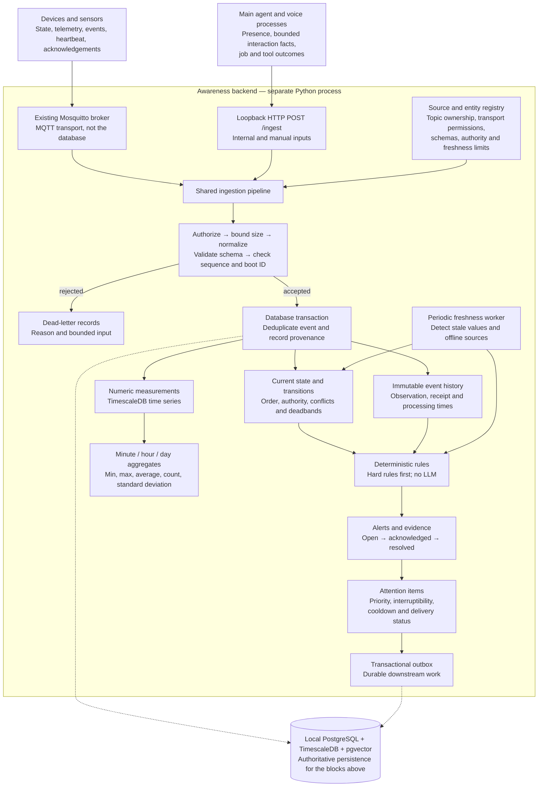
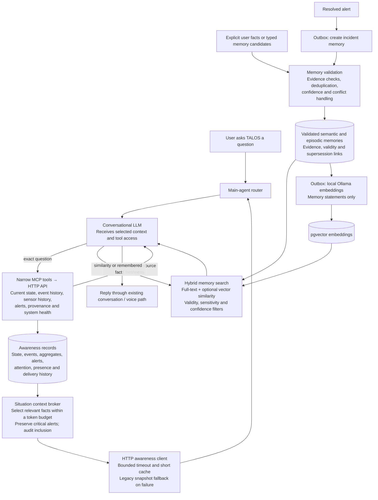
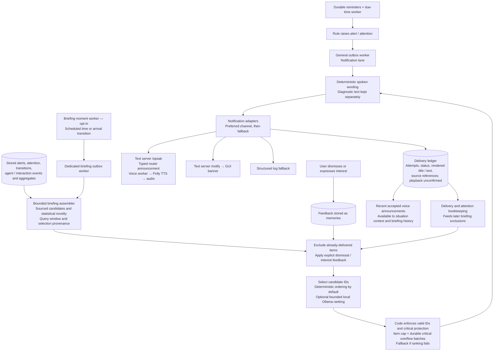
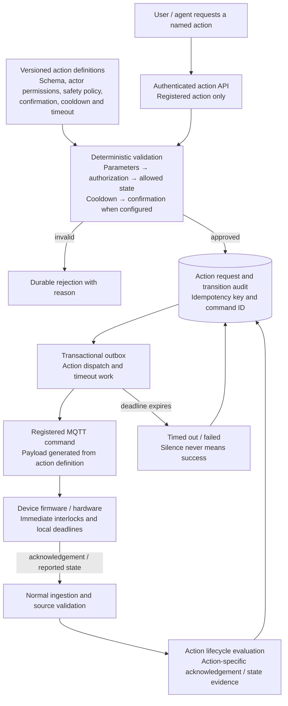

# Awareness system block diagram

Repository implementation snapshot: 2026-09-08. These diagrams describe the checked-out code, including the announcement repairs, rather than verifying which version is running. Phase 9 is implemented but production acceptance remains pending; proactive briefing and its model ranking are opt-in.

## 1. Incoming information becomes durable awareness

Accepted event storage, state/measurement effects, rule effects and associated outbox writes share a transaction. Network calls and model calls happen outside it. Late information can remain in history without rolling current state backward. Freshness qualifies whether a recorded value is still usable; a retained MQTT value alone is not proof of current state.

## 2. How the conversational agent knows what is happening

The snapshot includes alerts, attention, qualified state, meaningful transitions, source health, interaction-based owner presence and recent accepted awareness announcements. Presence is not a whole-home occupancy sensor. Exact questions such as “Is the pump on?” or “What was the average temperature?” use structured records, not vector similarity. Main-agent SQLite conversation storage remains separate; raw transcripts and telemetry do not become awareness memories automatically.

## 3. How TALOS speaks without a question

The clock and arrival detection run in deterministic code. The optional model chooses from existing candidates; it does not invent facts, suppress critical items, or rewrite delivered speech. A delivery receipt proves adapter acceptance, not that audio played or a person heard it. Transport can still duplicate after an ambiguous crash; end-to-end exactly-once delivery is not claimed. Core awareness is local-first; the existing Polly speech integration is an external TTS dependency.

## 4. Physical actions and the safety boundary

Physical retry policy is action-specific. Current pump paths use at-most-once dispatch where safe device-side deduplication has not been accepted. Firmware/hardware, not the backend or LLM, owns immediate physical safety. Current quad-pump fuse sensing is unimplemented and reported as unknown.

## Operations surrounding all four flows

Health endpoints, metrics and audit records expose disconnected sources, stale data, queue backlog and failures. Bounded outbox retries handle eligible work; failed work can be dead-lettered. Retention protects active evidence, refreshes required aggregates before deleting raw data, and runs in resumable batches. Memory consolidation, rooted artifacts and local backup/restore tooling support long-term operation.

## Source map and verification

- `talos/awareness/ingestion/pipeline.py`: shared ingestion and transaction effects.
- `talos/awareness/api/app.py`: composition and separate freshness, reminder, general-outbox and briefing workers.
- `talos/awareness/context/broker.py`: bounded conversational situation context and announcement recall.
- `talos/awareness/context/briefing.py` and `talos/awareness/briefing/selection.py`: candidate assembly and constrained model selection.
- `talos/awareness/README.md`: persistence, memory, delivery, actions and operational contracts.
- `docs/awareness-memory/IMPLEMENTATION_STATUS.md`: latest implementation and deployment limitations; newer repairs supersede historical snapshots.
- `docs/awareness-memory/ARCHITECTURAL_INVARIANTS.md`: permanent boundaries.

Documentation-only task. No runtime changes, service restarts, device commands or live deployment verification. No runtime tests run. Stop at the requested explanation/diagram boundary; no new phase is authorized.
