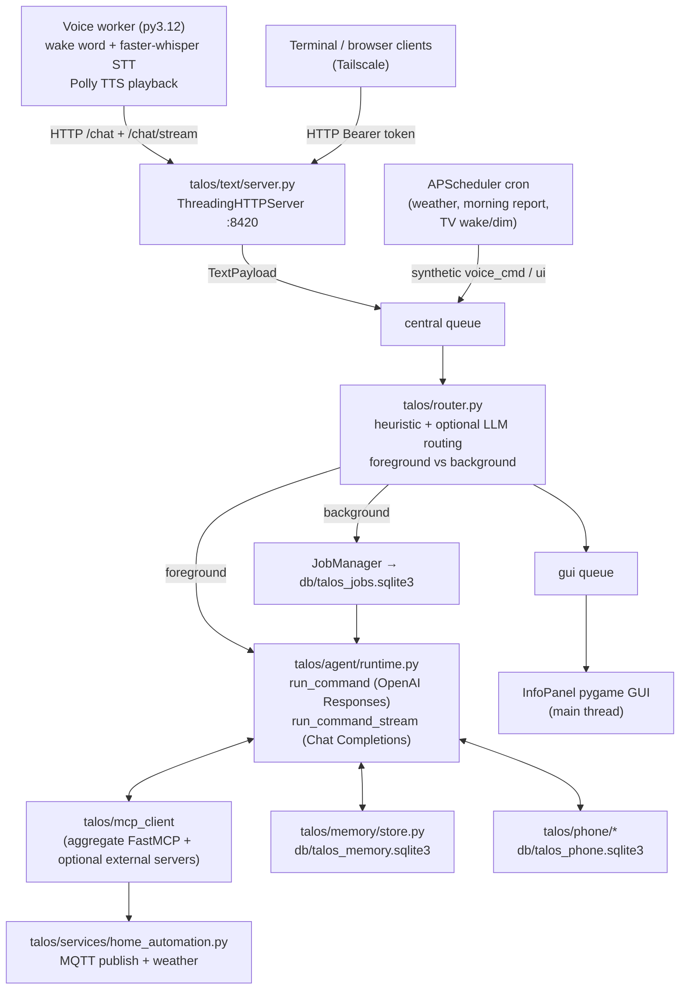
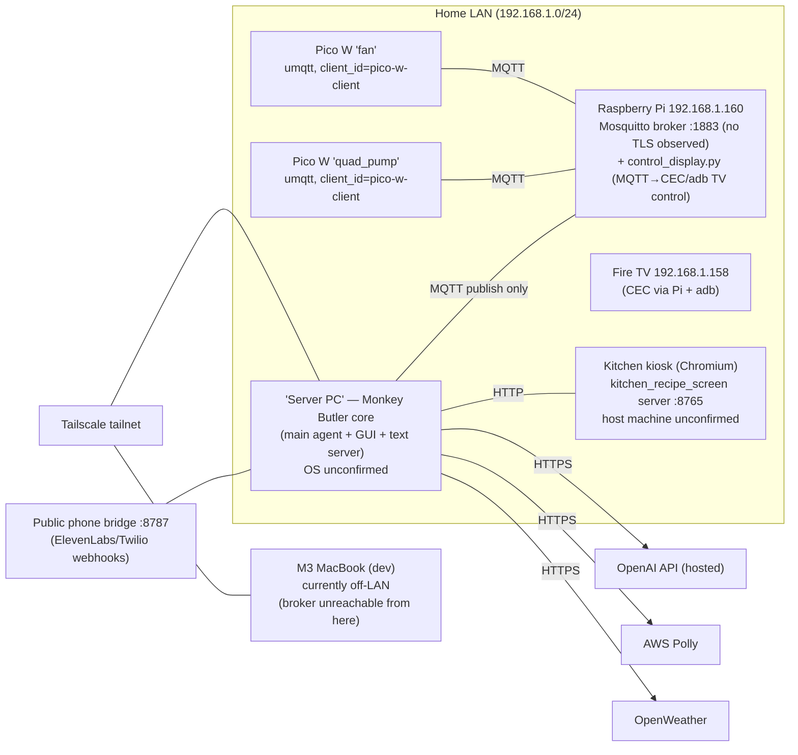

# DISCOVERY.md — Phase 0 Report

**Subsystem:** Robust distributed presence, awareness, event-processing, state, history, alerting, and memory backend ("awareness subsystem")
**Repository:** TALOS / B.U.T.L.E.R (`Lambchops118/Talos`)
**Branch:** written on `memory_system_2_07152026` (2026-07-15); ported to `memory_system_3_07152026` (2026-07-16)
**Date:** 2026-07-15, addendum 2026-07-16 (§15)
**Status:** Phase 0 complete and owner-reviewed — on 2026-07-16 the owner waived the review gate and authorized porting the branch-2 implementation and continuing phase-by-phase on this branch.

---

## 1. Repository Map

| Path | Role |
|---|---|
| `talos/` | Main agent package: router, agent runtime, LLM integration, text HTTP server, voice worker, scheduler, services, MCP client + MCP servers, phone stack, durable memory |
| `talos/agent/` | Agent runtime (`runtime.py`, 1758 lines), prompt assembly (`prompting.py`), personality docs loader |
| `talos/voice/` | Voice worker pipeline; `backends/` holds the pluggable LLM/STT backend seam (OpenAI-compatible Chat Completions, faster-whisper); `streaming/` holds sentence chunker + streaming speaker |
| `talos/services/` | Device/data actions: `home_automation.py` (MQTT publish + weather), `tv_control.py`, `kitchen_recipe_screen.py`, `morning_info.py` |
| `talos/mcp_servers/` | FastMCP tool providers (`providers/`), aggregate server, per-domain servers, Starlette HTTP mount (`talos/mcp_http_app.py`) |
| `talos/mcp_client/` | Multi-server MCP client (stdio + streamable HTTP, eager/lazy/sidecar lifecycles, tool merge/prefixing) |
| `talos/memory/` | SQLite conversational memory store (sessions, messages, facts, summaries) |
| `talos/phone/`, `talos/phone_bridge/` | ElevenLabs+Twilio outbound calling; separate public webhook bridge (ASGI, run via uvicorn) |
| `talos/text/` | Text agent HTTP server (stdlib `ThreadingHTTPServer`), terminal client, service client |
| `talos/scheduler/` | APScheduler cron jobs (weather refresh, display wake/dim, morning report) |
| `InfoPanel/` | Pygame GUI (main thread), visual assets |
| `Peripherals/` | MicroPython Pico W firmware (`fan/`, `quad_pump/`), Pi-side MQTT→CEC TV controller (`mqtt_server/control_display.py`), kitchen browser-kiosk server (`kitchen_recipe_screen/`) |
| `tests/` | `test_*.py` unittest-style tests (run directly or via unittest/pytest) mixed with older prototype scripts |
| `db/` | SQLite databases (gitignored): `talos_memory`, `talos_jobs`, `talos_phone` |
| `docs/` | Design/setup docs (async background execution plan, filesystem MCP, Minecraft diagnostics) |
| `archive/`, `experiments/` | Not part of the runtime |

**Language & tooling:** Python only. No `pyproject.toml`/packaging — run in place. Two venvs by convention: `.venv-main` (Python 3.10, `requirements-main-py310.txt`) and `.venv-voice` (Python 3.12, `requirements-voice-py312.txt`). No formatter, linter, or type checker is configured. CI (`.github/workflows/ci.yml`) only runs `python -m compileall InfoPanel Peripherals tests` on 3.12 — note it does **not** even compile `talos/`. Tests are stdlib `unittest` style (documented command: `python -m unittest tests/<file>.py`; also runnable as `python3 tests/<file>.py`); a `.pytest_cache` shows pytest is used locally too.

**Key dependencies (main venv):** `openai 2.7.0`, `mcp[cli]`, `paho-mqtt 2.1.0`, `APScheduler`, `boto3` (Polly), `requests`, `pyowm`, `pygame`, `moderngl`, `starlette`, `httpx`, `python-dotenv`. Voice venv adds `faster-whisper`, `openai-whisper`, `openwakeword`, `PyAudio`, `SpeechRecognition`.

**Repo coding conventions relevant to this subsystem:**
- Stdlib-first (sqlite3, http.server, dataclasses, threading, queue). Pydantic appears only transitively via the MCP SDK.
- SQLite pattern used 3× (`memory/store.py`, `jobs.py`, `phone/store.py`): WAL mode, `threading.RLock`, `CREATE TABLE IF NOT EXISTS` "ensure schema" (no migration framework), ISO-8601 UTC TEXT timestamps, JSON-in-TEXT columns, frozen dataclass row types, module-level default-store singleton.
- Config: flat `.env` at repo root loaded by `talos/config` helpers (`env_bool/env_int/env_float/require_env`); `.env.example` documents every variable.
- Multi-process split is an established pattern (main agent, voice worker, phone bridge are separate processes with separate venvs, talking over HTTP).

---

## 2. Current Runtime Architecture

- `python -m talos` starts: router thread, text agent server, APScheduler, pygame GUI (main thread).
- The router keeps an **in-memory `StateStore`** (TTL'd key/value snapshot) that is injected into prompts — but **nothing currently produces `type="status"` messages**, so it always reports "no recent status". It is effectively dormant. This is the only "current state" concept in the runtime today.
- Background lane: `JobManager` (SQLite-backed, worker threads, jobs marked `interrupted` on restart). This is the closest existing analogue to the prompt's outbox/worker pattern, and a good style reference.
- `msg.type == "event"` with `needs_llm=True` routes an event description straight into the LLM — there is no deterministic event pipeline.

---

## 3. Current Deployment Topology (as determinable)

Per-item findings (§4.2 of the prompt):

| Item | Finding | Confidence |
|---|---|---|
| Host running Ollama | **None today.** Ollama is not installed on the dev Mac; no `TALOS_LLM_BASE_URL` in `.env`; runtime defaults to hosted OpenAI (`gpt-4o-mini`). Prior plan (June 2026): deploy box = PC with RTX 5080 (vLLM) + RTX 2060; the new prompt states Qwen 12B Q4 via Ollama. Both work through the existing OpenAI-compatible seam. | needs owner confirmation |
| Host intended to run this subsystem | Prompt says "same machine as Ollama"; **owner note (2026-07-15) says the memory/database implementation may need to run on a separate machine than the LLM.** Design consequence: treat Ollama *and* PostgreSQL as network services (configurable host/port), never assume localhost. | confirmed_by_owner (separation possible) |
| Broker address/port | `192.168.1.160:1883` — default in `talos/services/home_automation.py` (`MQTT_BROKER`/`MQTT_PORT` env supported), **hardcoded** in `talos/scheduler/tasks.py`, both Pico firmwares, and `tests/publish_to_quad_pump.py`. Not set in `.env`. | confirmed_by_repo |
| MQTT TLS | No TLS anywhere in client code (plain `connect(host, 1883)`). Broker-side config not in repo. | confirmed_by_repo (client side) |
| MQTT auth/ACLs | No credentials passed by any client → broker presumably allows anonymous. No ACLs observable. | assumed_needs_confirmation |
| Known MQTT clients | 2× Pico W (fan, quad_pump — **both use client_id `pico-w-client`**), Pi `control_display.py` (localhost sub), host publishers (per-call throwaway clients). | confirmed_by_repo |
| Notification/TTS endpoints | Pygame GUI (gui_queue), Polly TTS inside the voice worker (responses to voice commands only), kitchen kiosk HTTP screen, outbound phone (LLM/session-gated). No deterministic push channel. | confirmed_by_repo |
| Clock sync (Linux hosts) | Not determinable from repo; assume NTP on Pi/host. | assumed_needs_confirmation |
| Embedded device clocks | Pico W firmware does no NTP sync → device clocks are untrustworthy. All Pico-origin events must be ordered by `received_at` with `clock_quality="server_received"`. | confirmed_by_repo |
| Network segments/firewall | Flat home LAN + Tailscale overlay for text-agent access (allowlist `127.0.0.1/32, ::1/128, 100.64.0.0/10, fd7a:115c:a1e0::/48`). | confirmed_by_repo |
| Components that must run while central host is down | Pico firmware behaviors and the Pi TV controller already run independently. **The pump's only "safety" behavior (fixed 8 s run) is local firmware**, consistent with the prompt's requirement that interlocks live in firmware. | confirmed_by_repo |
| Dev-machine reachability | The dev Mac cannot currently reach `192.168.1.160` (ping 100% loss) — development happens off-LAN, so the subsystem needs a config-driven broker target and a local test story. | confirmed_by_repo (at time of writing) |

---

## 4. Current MQTT Integration

**Direction: outbound commands only. The central runtime never subscribes to anything.** There is no ingestion path, no retained-message use, no LWT, no QoS >0, no reconnect handling on the host (each publish opens a fresh connection, QoS 0, disconnects — fire-and-forget).

Topics in use today:

| Topic | Producer → Consumer | Payload | Notes |
|---|---|---|---|
| `quad_pump/16..19` | host `water_plants()` → pump Pico | `"1"` / `"0"` | Only 17 (pot 1) and 19 (pot 2) used by the tool. `"1"` runs pump 8 s then auto-off |
| `fan/16` | host `toggle_fan()` → fan Pico | `1` / `0` | Fan relay is active-low (payload 1 → pin 0) |
| `tv_display/wake_status` | scheduler → Pi `control_display.py` | `"1"` / `"0"` | Pi translates to CEC power + adb input switch |
| `status/16..19` | **both** Picos → *(nobody)* | pin value | Published after every change; **unconsumed**, and fan + pump collide on `status/16`; fan publishes raw (inverted) pin level |

Existing behavior directly relevant to the new subsystem:
- `status/#` is a free, already-emitting device-state source the ingestion pipeline can subscribe to on day one — but its topic scheme carries no device identity (pin number only) and the fan's value semantics are inverted.
- The prompt's preferred scheme (`home/{domain}/{entity_id}/...`) does not exist yet. Adopting it for **new/updated** sources while consuming legacy topics through per-source adapters satisfies "do not change established topics without a migration plan."
- Firmware issues (see Risks) mean device-side reliability guarantees are currently near zero; the backend must not overstate delivery guarantees for these sources.

---

## 5. Current LLM / Tool Integration

Two parallel LLM paths exist:

1. **`run_command` (foreground/background text lane)** — OpenAI **Responses API** (`responses.create`) with `previous_response_id` threading per `(session_id, runtime_lane)` key, instructions rebuilt each turn from personality docs + overlays + memory block + runtime context, flat Responses-format tool defs, `temperature 0.5`, `max_output_tokens` default 400, bounded tool loop (`TALOS_MAX_TOOL_CALL_ROUNDS`, default 8), server-error retry/recovery logic, tool-output truncation/summarization (`TALOS_TOOL_OUTPUT_CHAR_LIMIT` 4000).
2. **`run_command_stream` (voice lane, default)** — OpenAI-compatible **Chat Completions** streaming through the backend seam (`talos/voice/backends/llm_openai_compat.py`, factory reads `TALOS_LLM_BACKEND/BASE_URL/MODEL/API_KEY/...`). This is the Ollama/vLLM-ready path; conversation history is managed manually. Sentence-chunked TTS overlap via `streaming/`.

Tool surface: MCP client merges tools from the built-in aggregate FastMCP server (home automation, kitchen screen, TV control) plus optional external MCP servers (KiCad, filesystem, Minecraft; stdio or streamable HTTP; eager/lazy/sidecar lifecycles). Host-level tools implemented directly in the runtime: MCP resource/server management, **`remember_memory_fact` / `list_memory_facts`** (direct, unvalidated upsert into durable SQLite facts — conflicts with C11's validation requirement, see Conflicts), and 4 phone tools.

Adapters that will be reused: `responses_tools_to_chat_tools`, `chat_messages_to_tool_result`, `tool_calls_to_assistant_message` in `talos/voice/backends/base.py`.

**Embeddings:** none anywhere in the repo today. Memory retrieval is SQL `LIKE` token matching ordered by salience/recency.

---

## 6. Current Notification Path

There is **no deterministic notification channel**. Today:
- Responses to commands appear on the pygame GUI (`("VOICE_CMD", command, response)` on the gui queue) and, for the voice lane, as Polly speech inside the voice worker.
- The only *proactive* behavior is the 07:30 morning report: APScheduler injects a synthetic `voice_cmd` through the central queue → LLM generates the report → GUI displays it. In the split-process setup nothing speaks it. It depends entirely on the LLM being up.
- The kitchen kiosk displays recipe/timer state pushed over HTTP.
- Outbound phone calls exist but are policy-gated to foreground user sessions — not a system alert channel.

Consequence: Phase 4 (alerts/notifications) needs at least one new deterministic delivery adapter (proposal in §11).

---

## 7. Current Persistence

| Store | File | Schema | Used by |
|---|---|---|---|
| Conversational memory | `db/talos_memory.sqlite3` | `sessions`, `messages`, `facts` (scope/key/value, salience 1–10, UNIQUE(scope,key) — **overwrites in place**, no history/supersession/provenance), `summaries` | agent runtime (prompt memory block ≤1600 chars; turn recording) |
| Background jobs | `db/talos_jobs.sqlite3` | `jobs`, `job_events` | router/JobManager, text server job endpoints |
| Phone | `db/talos_phone.sqlite3` | `phone_calls`, `phone_call_events` | phone service + bridge sync |
| Router state snapshot | in-memory only | key → (value, expires_at) | router prompts (dormant — no producers) |
| Kitchen state | `Peripherals/kitchen_recipe_screen/runtime/kitchen_state.json` | JSON document | kiosk server |

No PostgreSQL, no ORM, no migrations framework, no backups, no time-series storage, no vector storage. `db/` and `logs/` are gitignored.

---

## 8. Home Assistant Decision Gate (§4.3)

**Home Assistant is not present** — zero references in code, config, or docs; devices are raw MicroPython/MQTT. The gate resolves to: **this backend is the authoritative state/event layer; no HA overlap to manage.** If the owner runs HA somewhere undisclosed, an HA source adapter can be added later under C2 without architectural change.

---

## 9. Constraints, Conflicts with the Spec, and Risks

### 9.1 Repo facts that conflict with the implementation prompt (§4.1.15)

| # | Spec statement | Repo reality | Proposed resolution |
|---|---|---|---|
| 1 | "Currently uses Qwen 12B Q4 through Ollama" | Default LLM is hosted OpenAI `gpt-4o-mini`; Ollama-ready seam exists but Ollama isn't installed on the dev machine and no local base URL is configured | Build against the seam (OpenAI-compatible HTTP). All Ollama usage (chat + embeddings) behind configurable `ollama_host`. Nothing blocks on the cutover |
| 2 | "Ollama and the memory subsystem run on the same host" | Owner note (2026-07-15): memory/DB may need to run on a **separate machine** from the LLM | Treat LLM and DB as network services everywhere; no localhost assumptions; document both single-host and split-host deployments |
| 3 | "Do not hard-code the Raspberry Pi IP" | `192.168.1.160` hardcoded in scheduler, 2× firmware, 1 test; env-configurable only in `home_automation.py` | New subsystem: fully configured. Existing hardcodes listed for cleanup (small additive fixes, owner-approved) |
| 4 | Preferred topic scheme `home/{domain}/{entity_id}/...` | Flat legacy topics (`quad_pump/N`, `fan/N`, `status/N`, `tv_display/...`) | Consume legacy topics via source adapters; use `home/...` for new sources; firmware topic migration is a separate owner-approved step |
| 5 | C11: "LLM must not have unrestricted permanent-memory write access" | `remember_memory_fact` host tool upserts durable facts directly | Keep functioning initially (P9); in Phase 6 route it through the Memory Manager validation path as the tool's new backend |
| 6 | Default stack: Python 3.11+ | Main agent pinned to 3.10 (MCP), voice to 3.12 | Run the awareness backend as its **own process on Python 3.12** (established repo pattern); the 3.10 main agent talks to it over HTTP/MCP |
| 7 | P2: deterministic event loop | Router's `event` messages go straight to the LLM; StateStore is dormant | New ingestion pipeline supersedes both, additively; router untouched initially |

### 9.2 Risk list

**Distributed/MQTT (pre-existing, will surface during Phase 2):**
1. **Both Pico W boards use MQTT client ID `pico-w-client`.** Mosquitto disconnects the older session when a duplicate client ID connects — if both boards are powered, they will kick each other off in a loop. Any new backend subscriber would *see* the resulting churn. Firmware fix required (unique IDs).
2. **`status/{pin}` topic collision** — fan and pump both publish `status/16`, with no device identity and inverted semantics on the fan. Legacy adapter must map by *known deployment*, not topic alone; real fix is firmware topic change.
3. **Pump cannot be aborted mid-run:** firmware handles `"1"` with a blocking `time.sleep(8)`; a `"0"` sent during the run is not processed until after (contradicts the firmware's own docstring). Also blocks status publishing during the run. Safety-relevant given C14/overflow scenarios.
4. **No reconnect logic in firmware:** `umqtt.simple` raises on broker loss; the `while True: check_msg()` loop exits and the board is dead until power-cycle. Broker restart likely silently kills all peripherals.
5. **No delivery guarantees anywhere:** QoS 0, no acks, no command IDs; today "silence is success". C14 command-ack lifecycle requires firmware cooperation (at minimum `command_ack` publishes) — scope decision needed.
6. **Wi-Fi SSID/password and broker IP are committed in firmware files.** Secret hygiene issue; also means rotating Wi-Fi credentials requires reflashing.
7. **Broker is (apparently) anonymous, no TLS.** C17 requires auth/ACLs — needs Pi-side Mosquitto changes plus updating every client, so it must be an explicit owner-approved migration.

**Platform/deployment:**
8. Dev machine is currently off-LAN (broker unreachable) → integration tests and the simulator need a **test-only ephemeral broker** (e.g. Mosquitto in Docker, spun up per test run). This is *not* a second production broker; flagged for owner approval per the guardrail.
9. Homebrew PostgreSQL 18 exists on the dev Mac, but TimescaleDB/pgvector support for PG 18 lags — recommendation is Docker (`timescale` image, PG 17) rather than the Homebrew install; Docker 29 is present on the dev machine. Final backend host tooling unconfirmed.
10. Deploy-box OS is unconfirmed (Windows vs Linux affects service management + Docker story).
11. CI is compile-only and skips `talos/` entirely; new subsystem tests won't run in CI without extending the workflow (kept additive).

**Data/LLM:**
12. No embedding model exists yet anywhere; Ollama not installed → Phase 6 embedding work must queue/degrade per C16 from day one, and exact/FTS search must be the fallback.
13. Existing conversational memory (`facts` upsert-in-place) loses history by design — migration into the provenance-aware memory schema must not destroy the SQLite store (keep it running per P9, import selectively).

**Volumes (§14):** current traffic is trivial (a few messages per day of commands; `status/#` only after commands; 1/min scheduler weather poll via HTTP). Design target: comfortable at 10–100 msg/s burst, which the default stack handles without tuning. No premature optimization warranted.

---

## 10. Recommended Component → Repository Mapping

New code lives in a new package **`talos/awareness/`** (modular monolith, own process: `python -m talos.awareness`), with its own venv (`.venv-awareness`, Python 3.12, `requirements-awareness-py312.txt`) — mirroring the established main/voice split-process pattern. The 3.10 main agent consumes it over HTTP via a thin client + MCP tool provider.

| Prompt component | Location | Integration notes |
|---|---|---|
| C1 Event envelope | `talos/awareness/schemas/events.py` | Pydantic v2 (already transitive via MCP SDK) |
| C2 Source adapters / MQTT | `talos/awareness/ingestion/mqtt_client.py`, `talos/awareness/adapters/` | aiomqtt client → existing Pi broker; legacy-topic adapters for `status/#`, `tv_display/#`; weather adapter wraps the OpenWeather logic in `talos/services/home_automation.py`; phone adapter reads `talos/phone/store.py`; conversation adapter hooks the runtime's turn-recording seam |
| C3 Ingestion pipeline | `talos/awareness/ingestion/pipeline.py` (+ `normalization.py`, `deduplication.py`, `sequence.py`, `dead_letter.py`) | |
| C4 Registry | `talos/awareness/registry/` | Seed from known deployment: rooms, fan, quad_pump (2 pots), TV, Pi, kiosk, services |
| C5 Current state + situation | `talos/awareness/state/` | Replaces the dormant in-memory `StateStore` for the LLM path (router keeps working untouched until cutover) |
| C6 History + telemetry | `talos/awareness/history/` | TimescaleDB hypertables |
| C7 Rules engine | `talos/awareness/rules/` (`rules.yaml`) | |
| C8 Alerts + attention | `talos/awareness/alerts/` | |
| C9 Notifications | `talos/awareness/notifications/` | v1 adapters: (a) GUI banner via a new authenticated `POST /notify` on the existing text server → gui_queue (deterministic, LLM-free); (b) structured-log adapter. TTS/speaker adapter later — requires giving the voice worker an inbound endpoint or MQTT-subscribed notify topic (owner decision) |
| C10 Outbox + workers | `talos/awareness/outbox/` | Postgres `SKIP LOCKED`; style precedent: `talos/jobs.py` |
| C11 Memory + RAG | `talos/awareness/memory/` | pgvector; Ollama embeddings behind config; `remember_memory_fact` re-pointed here in Phase 6 |
| C12 Situation/context broker | `talos/awareness/context/` | Injected into `run_command`/`run_command_stream` in place of today's `state_snapshot` string |
| C13 LLM retrieval tools | `talos/awareness/api/` + new MCP provider `talos/mcp_servers/providers/awareness.py` | Provider registered in `talos/mcp_servers/aggregate.py` per README convention; tools are thin HTTP calls to the awareness API, so both LLM paths (Responses + Chat Completions) get them via the existing tool merge |
| C14 Actions | `talos/awareness/actions/` | Wraps MQTT command dispatch with command IDs/acks/timeouts; existing tool names (`water_plants`, `toggle_fan`) keep working, re-backed by the action service |
| C15 Retention + artifacts | `talos/awareness/retention/`, `talos/awareness/artifacts/` | Artifacts on local filesystem under a configured data dir |
| C16 Health + metrics | `talos/awareness/health/` | `/health`, `/health/components`; structured logging |
| C17 Security | config + docs | Bind API to localhost/LAN/tailnet; bearer token like the text server; broker auth migration plan |
| C18 Config + API | `talos/awareness/config.py` (pydantic-settings reading the same repo `.env`), FastAPI app `talos/awareness/api/` | Env names extend the existing `MQTT_BROKER`/`MQTT_PORT` convention |
| Simulator | `talos/awareness/simulator/publisher.py` | Targets any broker via config (existing Pi broker or test broker) |
| Tests | `tests/test_awareness_*.py` | Follow the flat `tests/` unittest-compatible convention; integration tests use Docker Postgres + Mosquitto |

---

## 11. Technology Stack Decision (§5)

**Decision: adopt the default stack, with these repo-fit adaptations** (owner approval requested):

| Default | Decision | Reason |
|---|---|---|
| Python 3.11+ | **3.12** | Already a supported repo runtime (voice venv, CI); available on dev Mac |
| PostgreSQL + TimescaleDB + pgvector | **Yes — via Docker Compose, `timescale/timescaledb-ha:pg17`** (bundles Timescale + pgvector) | Docker present on dev machine; Homebrew PG 18 predates Timescale support; identical image dev→prod |
| FastAPI | **Yes** (new process only) | Starlette already a dependency; existing stdlib `http.server` pattern stays untouched in the main agent |
| SQLAlchemy 2.x + Alembic | **Yes** (async engine + asyncpg) | No existing ORM/migrations to conflict with |
| Pydantic v2 | **Yes** | Already transitive |
| asyncio MQTT | **aiomqtt** (paho-based) | Repo already standardizes on paho lineage |
| Ollama local embeddings | **Yes, config-driven** (`ollama_host`, model name configurable); embedding work queues when unavailable | Ollama not installed anywhere yet |
| Local filesystem artifact store | **Yes** (configured data dir) | |
| Docker Compose for DB + backend | **Compose for DB (+ optional test Mosquitto); backend runs as a plain venv process initially** | Matches how every other TALOS process is run today; container for the backend can come later |
| Redis | **No** — no demonstrated need at current volumes | Guardrail: Postgres is authoritative |

**Proposed database deployment method:** `docker compose` file at repo root (or `talos/awareness/compose.yaml`) defining the Timescale/pgvector Postgres service with a named volume, localhost-bound port by default, credentials from `.env` (never committed). Alembic migrations run explicitly (`alembic upgrade head`), not automatically at import. Backup: `pg_dump` script + documented restore, per C17. If the final backend host cannot run Docker (e.g. Windows constraints), fallback is a native PG 16/17 install with Timescale+pgvector packages — documented, same migrations.

---

## 12. Assumptions Register

**confirmed_by_repo**
- Broker default `192.168.1.160:1883`, plain TCP, no client credentials anywhere in code.
- Central runtime is MQTT publish-only; no subscriber, no retained/LWT/QoS>0 usage; per-publish throwaway connections.
- Topics: `quad_pump/16..19`, `fan/16`, `tv_display/wake_status` (commands); `status/16..19` (device state, unconsumed, colliding).
- Both Pico firmwares share client ID `pico-w-client`; no NTP; no reconnect; pump run is blocking 8 s.
- LLM default = hosted OpenAI Responses API (`gpt-4o-mini`); streaming voice lane uses OpenAI-compatible Chat Completions seam; no Ollama configured; no embeddings anywhere.
- Persistence = 3 SQLite stores + dormant in-memory StateStore; no HA; no Docker/systemd/compose in repo; no backups.
- Text server auth = bearer token + localhost/Tailscale IP allowlist.
- Dev Mac: Python 3.10/3.12/3.14, Docker 29, Homebrew PG 18 present; no mosquitto clients; broker currently unreachable from it.

**confirmed_by_owner**
- Mosquitto broker runs on a Raspberry Pi on the LAN; reuse it (prompt + owner note, 2026-07-15).
- The memory/database subsystem may need to run on a different machine than the LLM (owner note, 2026-07-15) → all cross-component links are network-configurable.
- Target conversational model is Qwen (12B Q4 via Ollama per the prompt; earlier June plan said Qwen via vLLM on an RTX 5080 box — both served by the same OpenAI-compatible seam, so no design fork needed, but see Open Questions).
- Local-first requirement; no cloud DB/vector/embedding services.

**assumed_needs_confirmation**
- Broker allows anonymous connections and has no ACLs (server config not in repo).
- Pi and central host clocks are NTP-synced.
- The Pi at `.160` is static/reserved; whether the kitchen kiosk runs on the same Pi or another machine.
- Final host for the awareness backend + Postgres (dev Mac? "Server PC"? the Pi is assumed **not** a candidate for Postgres/Timescale).
- Deploy-box operating system.
- Owner appetite for firmware changes (unique client IDs, prefixed status topics, abort-during-run fix, reconnect loop, command acks) — several Phase 2/7 acceptance criteria are much weaker without them.
- Expected future sensor fleet (the prompt's examples mention temperature/moisture/overflow sensors that do not exist in the repo yet).

---

## 13. Proposed Implementation Sequence

Follow the prompt's Phases 1–8 with these repo-specific notes; the repo stays runnable after each phase and existing functionality is untouched until explicit cutover points.

1. **Phase 1 — Foundation:** `talos/awareness/` package, typed config, Compose file for Timescale/pgvector, Alembic baseline (all §10 tables that Phase 1 needs: locations, entities, relationships, sources, events, dead_letter_events, current_state, alerts, attention_items, outbox, schema_registry), `/health`, structured logging, new venv + requirements file, README section.
2. **Phase 2 — MQTT ingestion:** aiomqtt client with reconnect/backoff, canonical envelope validation, allowlist from source registry, dedup/sequence handling, dead-letter, legacy-topic adapters (`status/#`), simulator. *Blocked risks surfaced here: client-ID collision (needs firmware fix to test cleanly), test broker approval.*
3. **Phase 3 — State/health/telemetry:** state manager + freshness/offline workers, Timescale measurements + aggregates, bounded queries.
4. **Phase 4 — Rules/alerts/notifications:** YAML rules, alert lifecycle, attention items, outbox workers, GUI `POST /notify` adapter + log adapter, overflow end-to-end scenario via simulator (no Ollama dependency).
5. **Phase 5 — Situation + context broker + read tools:** situation snapshot replaces the dormant `state_snapshot` string in both LLM paths; awareness MCP tool provider; token budgets + selection audit.
6. **Phase 6 — Long-term memory:** memory schema + pgvector, Ollama embedding client (queue on unavailability), deterministic writes, LLM candidate validation, supersession/contradiction; re-point `remember_memory_fact` through the Memory Manager.
7. **Phase 7 — Actions:** action registry + lifecycle; re-back `water_plants`/`toggle_fan` through the action service with command IDs; acks require firmware cooperation (scoped with owner).
8. **Phase 8 — Retention/consolidation/security/hardening:** retention workers with dry-run, artifact store, backup/restore docs, failure-injection tests, metrics; broker auth/TLS migration plan executed if approved.

---

## 14. Open Questions for the Owner (blocking items marked ⛔)

> **Owner decisions (2026-07-15):** (1) The LLM host is the **same machine** as the Postgres + awareness backend — Qwen runs on Ollama on that machine (so `ollama_host` defaults to localhost but stays configurable). (2) Dockerized test-only Mosquitto **approved**. (3) **Simulated hardware** for now — no firmware changes in scope; device acceptance criteria run against the simulator. (4) Stack adaptations (§11) and GUI-banner `POST /notify` **approved**. Implementation authorized to proceed from Phase 1.

1. ⛔ **Where should the awareness backend + PostgreSQL run** (dev Mac for now, the "Server PC", other)? And which host will run Ollama — and is it Ollama (per this prompt) or vLLM (per the June voice plan)? The code treats both identically; this only affects deployment docs and compose placement.
2. ⛔ **Approve a test-only ephemeral Mosquitto (Docker) for integration tests/simulator** while developing off-LAN. Production continues to use the Pi broker exclusively.
3. **Firmware changes in scope?** Unique client IDs + prefixed status topics + abort-during-run fix + reconnect loop (+ later command acks and heartbeats). Without these, Phase 2/7 acceptance criteria for the physical devices are only demonstrable via the simulator.
4. **Broker hardening:** OK to plan username/password + ACLs (and optionally TLS) on the Pi Mosquitto in Phase 8? Requires touching every client including firmware.
5. **Notification v1 channels:** confirm GUI banner (`POST /notify` on the text server) + structured log as the Phase 4 adapters, with speaker/TTS as a follow-up (needs a voice-worker inbound endpoint or MQTT notify topic).
6. **Stack sign-off** per §11 (default stack with listed adaptations), including the new 3.12 process/venv.

---

---

## 15. Addendum — 2026-07-16 (branch `memory_system_3_07152026`)

Re-verified on this branch before resuming implementation; all §12
`confirmed_by_repo` facts still hold, with these updates:

1. **New inbound event path (repo change since 2026-07-15):** commit
   `15bd052` added an authenticated `POST /phone/events` push ingress on the
   text server (`talos/text/server.py`, shared secret
   `TALOS_PHONE_PUSH_TOKEN` in the `X-Phone-Push-Token` header). The phone
   bridge pushes completed-call snapshots; the handler ingests them into the
   phone SQLite store and emits a `phone_call_completed` event into the
   central queue, which the router feeds **directly to the LLM** (still no
   deterministic pipeline). Relevant as (a) a second push-style event source
   for a future C2 phone adapter and (b) the established repo convention for
   authenticated push endpoints — the same pattern proposed for the Phase 4
   `POST /notify` adapter.
2. **Owner decisions (2026-07-16):** the Phase 0 review gate is satisfied/
   waived; the Phase 0+1 work (commit `88f0e64`) and partial Phase 2 (commit
   `08b510e`) from `memory_system_2_07152026` were cherry-picked onto this
   branch rather than reimplemented, and implementation continues
   phase-by-phase under `docs/awareness-memory/` (which supersedes the
   original prompt file as the working specification).
3. This document moved from the repo root to
   `docs/awareness-memory/DISCOVERY.md` per `phases/PHASE_00_DISCOVERY.md`.

*Prepared as the Phase 0 deliverable; §1-§14 record the state observed on
2026-07-15 before any implementation existed.*
